# Alternator V11.2 — Per-VIN RUL + Physics Evidence Stack: Reading Guide & Insights

**Date:** 2026-06-24  ·  **Figures:** `V11.2_ALT/visualizations/rul_evidence_stack/`  ·  **Fleet:** 25 trucks (10 failed VIN1–10, 15 in-service VIN11–25)

## How to read these graphs (applies to every VIN)

Each figure stacks **five time-aligned panels** that share one calendar x-axis (Panel 4 uses engine RPM).
Vertical guide lines mark the same moments across panels: **grey dotted** = last data, **orange dashed** =
first physics deviation, **dark** = failure (red ✕) or forecast.

> **The one honest idea to hold onto:** Panel 1's RUL line is a **fleet clock** — a schedule based on how
> long alternators in this fleet last, *not* a per-truck prediction. The truck's *own* condition lives in
> Panels 1b–4. When the schedule and the physics disagree, **trust the physics.**

### Panel 1 — Remaining life: the FLEET SCHEDULE (age-based, not per-truck)
- **Simple:** how many days the *fleet average* says are left — a **schedule**, not a per-truck prediction.
  It slides down with age toward the failure ✕ (or a dotted forecast for healthy trucks); right axis = km.
- **Technical:** conditional Weibull posterior median + 80 % band over age; horizon zones at 180/90/30 d.
- **Read the over-prediction — don't be fooled by the drop.** For these premature failures the schedule still
  showed **130–270 days of life at the last reading**, so the curve drops sharply to the actual failure ✕,
  labelled *"OVER-PREDICTED ~X d expected vs Y d actual."* That gap is **honest and expected**: an age-based
  fleet clock cannot see an individual truck about to fail. It is **not** smoothed into a fake gradual decline.
  This is exactly why per-truck RUL is reported as a **band + the 601 d fleet window — never a per-truck
  promise** — and why the condition panels (1b–4) are where the real per-truck warning lives.

### Panel 1b — Health zone (parameter-driven M5)
- **Simple:** a single "health score" built from the truck's own voltage and excitation behaviour. When it
  steps up a zone, a numbered tag says **what moved it** (e.g. "→ORANGE · GED2 rate").
- **Technical:** M5 = weighted sum of VSI deviation, VSI volatility, GED2 rate, VSI range (recalibrated,
  thresholds 0.15/0.35/0.55). The transition driver is the largest-contributing component at that date.
  This is the parameter-decided zone view (the weaker system — it can flag early/transiently — so it is
  supporting evidence, not the primary alarm).

### Panel 2 — Voltage health (condition)
- **Simple:** the truck's charging voltage over time. The green band (27–29 V) is healthy; the red dashed
  line (24 V) is a sag threshold; tick marks at the bottom are days it sagged.
- **Technical:** daily VSI mean + p05–p95 envelope; 28.2 V DICV nominal; resting (engine-off) voltage
  dashed. Persistent drift below the band or rising sag density indicates regulation/charging loss.

### Panel 3 — Precursor signals (physics early-warning)
- **Simple:** several "is-it-getting-worse?" signals, all drawn so **up = worse**. A signal in **bold colour**
  has crossed the worry line; **grey** signals are quiet. If nothing crosses, it says *"No precursor detected."*
- **Technical:** each signal as **σ above the truck's own healthy baseline** (smoothed). The σ=2 dashed line
  is the discriminative gate; the legend lists breaching signals; the GED2 storm is marked separately. The
  orange callout gives the first-deviation lead time.

### Panel 4 — Charging signature (the "why")
- **Simple:** the alternator's voltage at different engine speeds, **early life (green)** vs **late life (red)**.
  If the red line drops below the green, the alternator is losing its ability to hold voltage.
- **Technical:** median VSI binned by RPM (600–2500). A late-life drop in the high-RPM plateau ("ceiling")
  is the physical fingerprint of stator/diode/regulation wear; overlapping lines = regulation still intact.

## Fleet summary

| VIN | Status | Risk | Archetype | Precursor (at failure / now) | M5 (final · peak) | Schedule over-pred | Charging Δ |
|---|---|---|---|---|---|---|---|
| VIN1_F_ALT | FAILED | red | Early-warning (GED2 storm ~21d) | GED2 ~21d | RED | ~162 d | +0.20 V |
| VIN2_F_ALT | FAILED | red | Late precursor: under-voltage sag (~16d) | under-voltage sag ~16d | ORANGE | ~158 d | +0.20 V |
| VIN3_F_ALT | FAILED | red | Silent / abrupt failure | — | GREEN · peak YELLOW | ~112 d | +0.00 V |
| VIN4_F_ALT | FAILED | amber | Silent / abrupt failure | — | YELLOW | ~133 d | +0.00 V |
| VIN5_F_ALT | FAILED | green | Silent / abrupt failure | — | GREEN | ~135 d | +0.00 V |
| VIN6_F_ALT | FAILED | red | Late precursor: crank-recovery t (~11d) | crank-recovery t ~11d | GREEN · peak YELLOW | ~205 d | +0.00 V |
| VIN7_F_ALT | FAILED | red | Silent / abrupt failure | — | GREEN | ~130 d | +0.00 V |
| VIN8_F_ALT | FAILED | red | Silent / abrupt failure | — | YELLOW · peak ORANGE | ~189 d | +0.00 V |
| VIN9_F_ALT | FAILED | amber | Silent / abrupt failure | — | GREEN | ~167 d | +0.00 V |
| VIN10_F_ALT | FAILED | red | Early-warning (GED2 storm ~1d) | crank-recovery t ~11d | ORANGE | ~268 d | +0.00 V |
| VIN11_NF_ALT | in-service | green | In-service — quiet | — | GREEN | — | +0.20 V |
| VIN12_NF_ALT | in-service | amber | In-service — quiet | — | GREEN · peak YELLOW | — | +0.20 V |
| VIN13_NF_ALT | in-service | amber | In-service — quiet | — | GREEN · peak YELLOW | — | +0.00 V |
| VIN14_NF_ALT | in-service | amber | In-service — quiet | — | GREEN · peak YELLOW | — | +0.20 V |
| VIN15_NF_ALT | in-service | green | In-service — quiet | — | GREEN · peak YELLOW | — | +0.20 V |
| VIN16_NF_ALT | in-service | amber | In-service — quiet | — | GREEN · peak ORANGE | — | +0.00 V |
| VIN17_NF_ALT | in-service | amber | In-service — quiet | — | GREEN · peak YELLOW | — | +0.00 V |
| VIN18_NF_ALT | in-service | amber | In-service — quiet | — | YELLOW | — | +0.00 V |
| VIN19_NF_ALT | in-service | green | In-service — quiet | — | ORANGE | — | -0.20 V |
| VIN20_NF_ALT | in-service | amber | In-service — quiet | — | GREEN · peak ORANGE | — | +0.10 V |
| VIN21_NF_ALT | in-service | green | In-service — quiet | — | GREEN · peak ORANGE | — | +0.00 V |
| VIN22_NF_ALT | in-service | green | In-service — quiet | — | GREEN · peak ORANGE | — | +0.20 V |
| VIN23_NF_ALT | in-service | green | In-service — quiet | — | GREEN · peak YELLOW | — | +0.00 V |
| VIN24_NF_ALT | in-service | green | In-service — quiet | — | GREEN | — | +0.00 V |
| VIN25_NF_ALT | in-service | amber | In-service — quiet | — | YELLOW · peak ORANGE | — | -0.20 V |

**Archetypes:** *Early-warning (GED2 storm)* — rare, gives short-horizon notice · *Gradual precursor* — a signal drifts over weeks/months · *Silent/abrupt* — no warning, the hard case · *In-service watch / quiet* — healthy trucks with vs without an elevated signal.

## Per-VIN reading & insights

### VIN1_F_ALT  ·  _Early-warning (GED2 storm ~21d)_

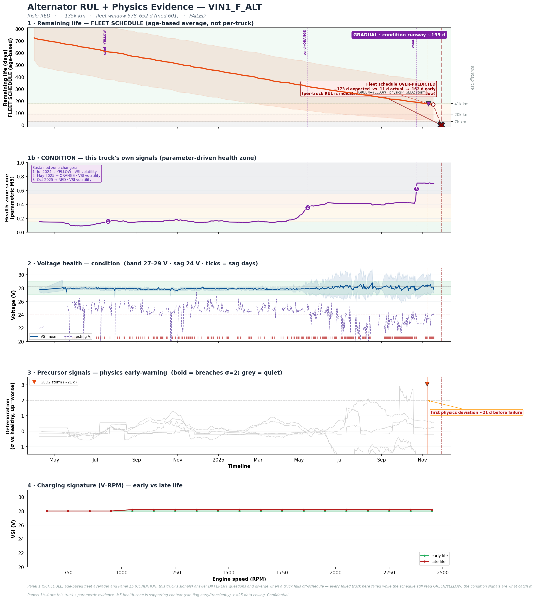

**In simple terms.** **VIN1_F_ALT** is a truck that **failed**. On the fleet's wear-out clock it still looked like it had ~173 days of life at last contact (clock zone **YELLOW**). It gave no early electrical warning — it failed quietly, with the sensors looking normal until the end. The excitation-fault 'storm' also fired about 21 days ahead — a rare, high-confidence alarm. Its charging voltage held steady to the end. Critically, the fleet schedule still expected ~173 more days at that point — it **over-predicted by ~162 days** because this truck failed early; that gap is why we report a fleet window, not a per-truck day-count.

**Technically.** Risk band **red**; est. ~135k km; fleet wear-out window 578–652 d (median 601). Parametric M5 health-zone transitions: Jul 2024→YELLOW (driver: VSI volatility); May 2025→ORANGE (driver: VSI volatility); Oct 2025→RED (driver: VSI volatility); final M5 zone **RED**. No signal is elevated at the end (σ<2) — no genuine precursor. Schedule over-prediction: fleet clock RUL@last 173 d vs 11 d to actual failure → over by ~162 d (clock zone YELLOW at failure). GED2 excitation storm fired (~21 d lead). Charging ceiling (≥1500 rpm) early→late Δ = +0.20 V (stable regulation). RUL-clock crossings: GREEN→YELLOW (physics✓ GED2 storm).

**Key insights.**
- **Actionable signature.** The GED2 storm gives ~21 d notice — the one archetype where a short-horizon pager is viable; deploy the GED channel for trucks like this.
- **Parametric driver:** the worst health-zone step (RED, Oct 2025) was driven by **VSI volatility** — the signal to watch on this truck.

**Snapshot — every component at each key moment (read down a column):**

| Component | Early (2024-05-31) | Cond→ORANGE (2025-05-14) | Cond→RED (2025-10-23) | First deviation (2025-11-08) | Failure (2025-11-29) |
|---|---|---|---|---|---|
| Effective zone | GREEN | YELLOW | RED | RED | RED |
| RUL (schedule) | 663 d (GREEN) | 321 d (GREEN) | 190 d (GREEN) | 179 d (YELLOW) | 173 d (YELLOW) |
| Condition (M5) | 0.10 (GREEN) | 0.36 (ORANGE) | 0.62 (RED) | 0.70 (RED) | 0.69 (RED) |
| VSI mean | 28.0 V | 27.9 V | 27.8 V | 28.2 V | 27.8 V |
| Resting V | 26.0 V | 25.6 V | 23.7 V | 24.2 V | 24.2 V |
| Sag rate | 0.00 | 0.00 | 0.00 | 0.00 | 0.00 |
| Crank-recovery | -0.2σ | -0.2σ | -0.2σ | -0.2σ | -0.2σ |
| Reg. ceiling | -0.3σ | -0.2σ | -1.5σ | -1.5σ | -1.8σ |
| GED2 | — | — | — | STORM | — |

### VIN2_F_ALT  ·  _Late precursor: under-voltage sag (~16d)_

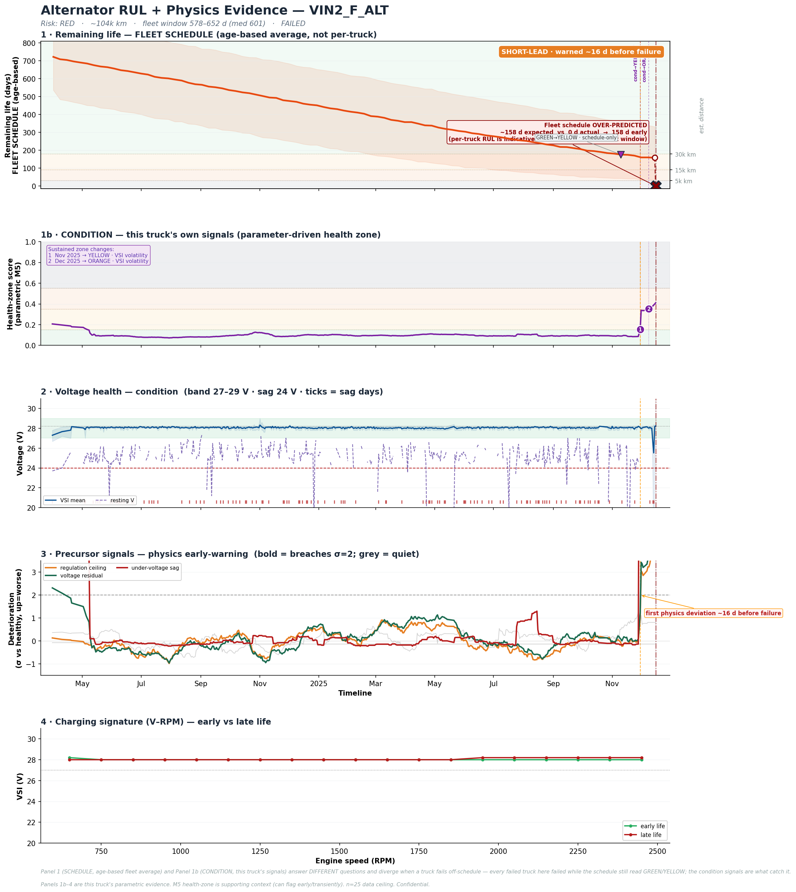

**In simple terms.** **VIN2_F_ALT** is a truck that **failed**. On the fleet's wear-out clock it still looked like it had ~158 days of life at last contact (clock zone **YELLOW**). It gave an early electrical warning: the under-voltage sag signal stood out about 16 days before it failed. Its charging voltage held steady to the end. Critically, the fleet schedule still expected ~158 more days at that point — it **over-predicted by ~158 days** because this truck failed early; that gap is why we report a fleet window, not a per-truck day-count.

**Technically.** Risk band **red**; est. ~104k km; fleet wear-out window 578–652 d (median 601). Parametric M5 health-zone transitions: Nov 2025→YELLOW (driver: VSI volatility); Dec 2025→ORANGE (driver: VSI volatility); final M5 zone **ORANGE**. Signals genuinely elevated at failure (σ≥2 at the end): under-voltage sag (run-up ~16 d), regulation ceiling (run-up ~15 d), voltage residual (run-up ~15 d). Schedule over-prediction: fleet clock RUL@last 158 d vs 0 d to actual failure → over by ~158 d (clock zone YELLOW at failure). Charging ceiling (≥1500 rpm) early→late Δ = +0.20 V (stable regulation). RUL-clock crossings: GREEN→YELLOW (schedule-only).

**Key insights.**
- **Physics led the schedule.** under-voltage sag deviated ~16 d before failure — earlier evidence than the fleet clock provided.
- **Parametric driver:** the worst health-zone step (ORANGE, Dec 2025) was driven by **VSI volatility** — the signal to watch on this truck.

**Snapshot — every component at each key moment (read down a column):**

| Component | Early (2024-05-28) | First deviation (2025-11-30) | Cond→ORANGE (2025-12-09) | Failure (2025-12-16) |
|---|---|---|---|---|
| Effective zone | GREEN | YELLOW | YELLOW | YELLOW |
| RUL (schedule) | 664 d (GREEN) | 161 d (YELLOW) | 159 d (YELLOW) | 158 d (YELLOW) |
| Condition (M5) | 0.09 (GREEN) | 0.15 (YELLOW) | 0.35 (ORANGE) | 0.41 (ORANGE) |
| VSI mean | 28.1 V | 28.1 V | 28.0 V | 28.2 V |
| Resting V | 24.8 V | nan V | nan V | nan V |
| Sag rate | 0.00 | 0.00 | 0.00 | 0.00 |
| Crank-recovery | -0.1σ | -0.1σ | -0.1σ | -0.1σ |
| Reg. ceiling | -0.2σ | +1.0σ | +3.2σ | +4.8σ |
| GED2 | — | — | — | — |

### VIN3_F_ALT  ·  _Silent / abrupt failure_

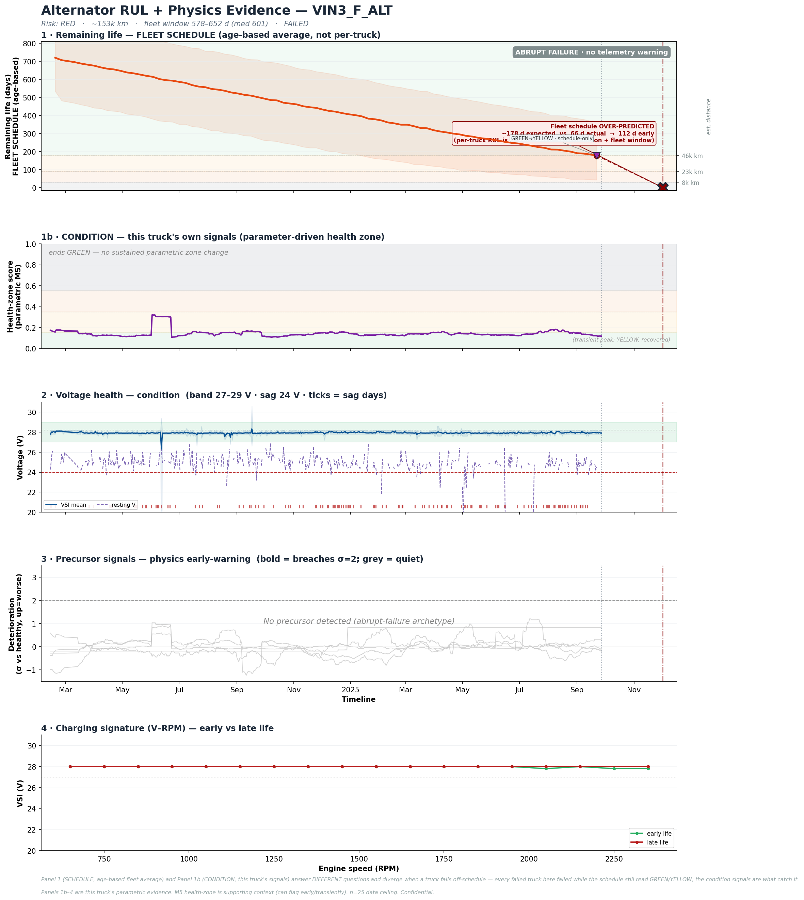

**In simple terms.** **VIN3_F_ALT** is a truck that **failed**. On the fleet's wear-out clock it still looked like it had ~178 days of life at last contact (clock zone **YELLOW**). It gave no early electrical warning — it failed quietly, with the sensors looking normal until the end. Its charging voltage held steady to the end. Critically, the fleet schedule still expected ~178 more days at that point — it **over-predicted by ~112 days** because this truck failed early; that gap is why we report a fleet window, not a per-truck day-count.

**Technically.** Risk band **red**; est. ~153k km; fleet wear-out window 578–652 d (median 601). M5 health-zone stayed **GREEN** throughout (no parametric transition). No signal is elevated at the end (σ<2) — no genuine precursor. M5 transiently peaked at YELLOW then recovered (not a sustained zone change). Schedule over-prediction: fleet clock RUL@last 178 d vs 66 d to actual failure → over by ~112 d (clock zone YELLOW at failure). Charging ceiling (≥1500 rpm) early→late Δ = +0.00 V (stable regulation). RUL-clock crossings: GREEN→YELLOW (schedule-only).

**Key insights.**
- **Hardest case — silent failure.** No precursor and no parametric zone change; only the fleet replacement window protects this truck. Confirms the abrupt-failure archetype.

**Snapshot — every component at each key moment (read down a column):**

| Component | Early (2024-04-14) | Failure (2025-12-02) |
|---|---|---|
| Effective zone | GREEN | YELLOW |
| RUL (schedule) | 661 d (GREEN) | 178 d (YELLOW) |
| Condition (M5) | 0.13 (GREEN) | 0.12 (GREEN) |
| VSI mean | 27.9 V | 27.9 V |
| Resting V | 23.6 V | nan V |
| Sag rate | 0.00 | 0.00 |
| Crank-recovery | -0.2σ | +0.8σ |
| Reg. ceiling | +0.2σ | -0.1σ |
| GED2 | — | — |

### VIN4_F_ALT  ·  _Silent / abrupt failure_

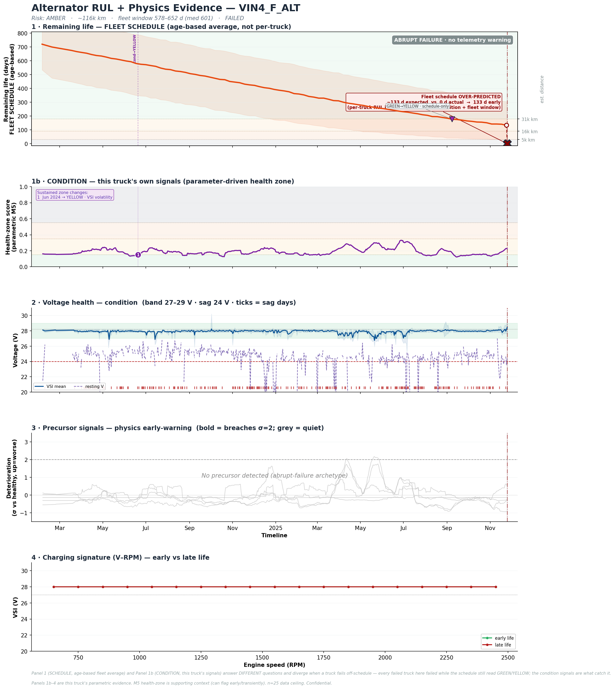

**In simple terms.** **VIN4_F_ALT** is a truck that **failed**. On the fleet's wear-out clock it still looked like it had ~133 days of life at last contact (clock zone **YELLOW**). It gave no early electrical warning — it failed quietly, with the sensors looking normal until the end. Its charging voltage held steady to the end. Critically, the fleet schedule still expected ~133 more days at that point — it **over-predicted by ~133 days** because this truck failed early; that gap is why we report a fleet window, not a per-truck day-count.

**Technically.** Risk band **amber**; est. ~116k km; fleet wear-out window 578–652 d (median 601). Parametric M5 health-zone transitions: Jun 2024→YELLOW (driver: VSI volatility); final M5 zone **YELLOW**. No signal is elevated at the end (σ<2) — no genuine precursor. Schedule over-prediction: fleet clock RUL@last 133 d vs 0 d to actual failure → over by ~133 d (clock zone YELLOW at failure). Charging ceiling (≥1500 rpm) early→late Δ = +0.00 V (stable regulation). RUL-clock crossings: GREEN→YELLOW (schedule-only).

**Key insights.**
- **Hardest case — silent failure.** No precursor and no parametric zone change; only the fleet replacement window protects this truck. Confirms the abrupt-failure archetype.
- **Parametric driver:** the worst health-zone step (YELLOW, Jun 2024) was driven by **VSI volatility** — the signal to watch on this truck.

**Snapshot — every component at each key moment (read down a column):**

| Component | Early (2024-03-31) | Failure (2025-11-25) |
|---|---|---|
| Effective zone | YELLOW | YELLOW |
| RUL (schedule) | 662 d (GREEN) | 133 d (YELLOW) |
| Condition (M5) | 0.18 (YELLOW) | 0.23 (YELLOW) |
| VSI mean | 27.9 V | 28.4 V |
| Resting V | 23.2 V | 24.4 V |
| Sag rate | 0.00 | 0.00 |
| Crank-recovery | -0.1σ | -0.1σ |
| Reg. ceiling | -0.3σ | -0.2σ |
| GED2 | — | — |

### VIN5_F_ALT  ·  _Silent / abrupt failure_

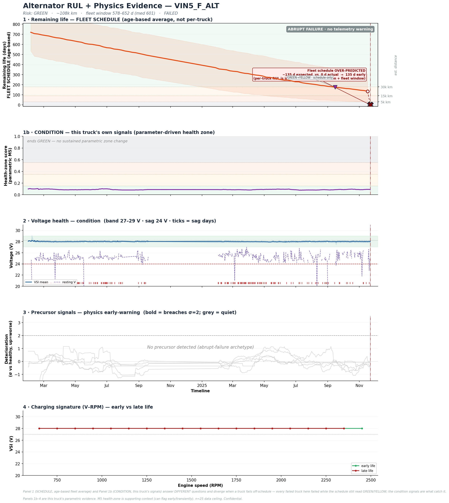

**In simple terms.** **VIN5_F_ALT** is a truck that **failed**. On the fleet's wear-out clock it still looked like it had ~135 days of life at last contact (clock zone **YELLOW**). It gave no early electrical warning — it failed quietly, with the sensors looking normal until the end. Its charging voltage held steady to the end. Critically, the fleet schedule still expected ~135 more days at that point — it **over-predicted by ~135 days** because this truck failed early; that gap is why we report a fleet window, not a per-truck day-count.

**Technically.** Risk band **green**; est. ~108k km; fleet wear-out window 578–652 d (median 601). M5 health-zone stayed **GREEN** throughout (no parametric transition). No signal is elevated at the end (σ<2) — no genuine precursor. Schedule over-prediction: fleet clock RUL@last 135 d vs 0 d to actual failure → over by ~135 d (clock zone YELLOW at failure). Charging ceiling (≥1500 rpm) early→late Δ = +0.00 V (stable regulation). RUL-clock crossings: GREEN→YELLOW (schedule-only).

**Key insights.**
- **Hardest case — silent failure.** No precursor and no parametric zone change; only the fleet replacement window protects this truck. Confirms the abrupt-failure archetype.

**Snapshot — every component at each key moment (read down a column):**

| Component | Early (2024-03-31) | Failure (2025-11-22) |
|---|---|---|
| Effective zone | GREEN | YELLOW |
| RUL (schedule) | 663 d (GREEN) | 135 d (YELLOW) |
| Condition (M5) | 0.09 (GREEN) | 0.09 (GREEN) |
| VSI mean | 28.0 V | 28.0 V |
| Resting V | 24.7 V | 24.8 V |
| Sag rate | 0.00 | 0.00 |
| Crank-recovery | +0.1σ | -0.1σ |
| Reg. ceiling | +0.0σ | -0.4σ |
| GED2 | — | — |

### VIN6_F_ALT  ·  _Late precursor: crank-recovery t (~11d)_

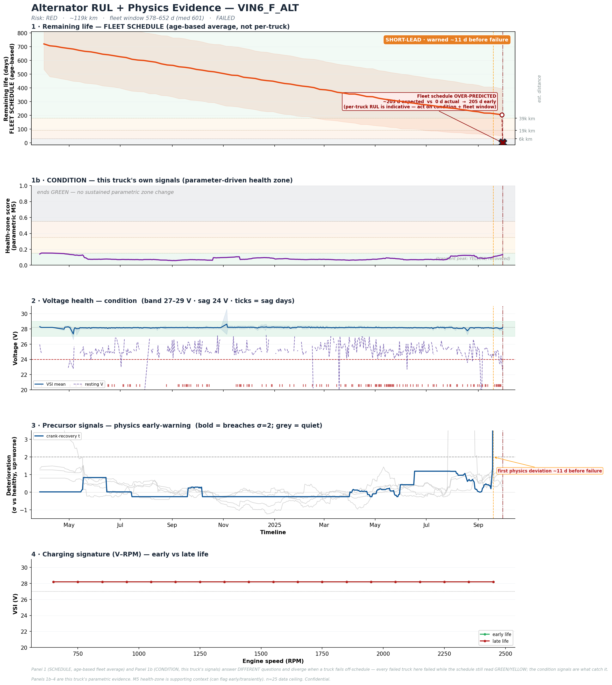

**In simple terms.** **VIN6_F_ALT** is a truck that **failed**. On the fleet's wear-out clock it still looked like it had ~205 days of life at last contact (clock zone **GREEN**). It gave an early electrical warning: the crank-recovery t signal stood out about 11 days before it failed. Its charging voltage held steady to the end. Critically, the fleet schedule still expected ~205 more days at that point — it **over-predicted by ~205 days** because this truck failed early; that gap is why we report a fleet window, not a per-truck day-count.

**Technically.** Risk band **red**; est. ~119k km; fleet wear-out window 578–652 d (median 601). M5 health-zone stayed **GREEN** throughout (no parametric transition). Signals genuinely elevated at failure (σ≥2 at the end): crank-recovery t (run-up ~11 d). M5 transiently peaked at YELLOW then recovered (not a sustained zone change). Schedule over-prediction: fleet clock RUL@last 205 d vs 0 d to actual failure → over by ~205 d (clock zone GREEN at failure). Charging ceiling (≥1500 rpm) early→late Δ = +0.00 V (stable regulation). RUL clock never crossed a lower zone before failure — it failed while the schedule still read **GREEN** (clock ≠ physics).

**Key insights.**
- **Physics led the schedule.** crank-recovery t deviated ~11 d before failure — earlier evidence than the fleet clock provided.
- **Clock ≠ physics.** It failed while the RUL schedule still read GREEN — the parameters (M5 / precursors), not the calendar, are what flagged the risk.

**Snapshot — every component at each key moment (read down a column):**

| Component | Early (2024-05-26) | First deviation (2025-09-19) | Failure (2025-09-30) |
|---|---|---|---|
| Effective zone | GREEN | GREEN | GREEN |
| RUL (schedule) | 663 d (GREEN) | 213 d (GREEN) | 205 d (GREEN) |
| Condition (M5) | 0.07 (GREEN) | 0.11 (GREEN) | 0.14 (GREEN) |
| VSI mean | 28.1 V | 28.1 V | 28.2 V |
| Resting V | 24.9 V | 24.4 V | 22.5 V |
| Sag rate | 0.00 | 0.00 | 0.00 |
| Crank-recovery | +0.8σ | +29.1σ | +39.1σ |
| Reg. ceiling | +0.8σ | +1.4σ | +0.2σ |
| GED2 | — | — | — |

### VIN7_F_ALT  ·  _Silent / abrupt failure_

**In simple terms.** **VIN7_F_ALT** is a truck that **failed**. On the fleet's wear-out clock it still looked like it had ~130 days of life at last contact (clock zone **YELLOW**). It gave no early electrical warning — it failed quietly, with the sensors looking normal until the end. Its charging voltage held steady to the end. Critically, the fleet schedule still expected ~130 more days at that point — it **over-predicted by ~130 days** because this truck failed early; that gap is why we report a fleet window, not a per-truck day-count.

**Technically.** Risk band **red**; est. ~113k km; fleet wear-out window 578–652 d (median 601). M5 health-zone stayed **GREEN** throughout (no parametric transition). No signal is elevated at the end (σ<2) — no genuine precursor. Schedule over-prediction: fleet clock RUL@last 130 d vs 0 d to actual failure → over by ~130 d (clock zone YELLOW at failure). Charging ceiling (≥1500 rpm) early→late Δ = +0.00 V (stable regulation). RUL-clock crossings: GREEN→YELLOW (schedule-only).

**Key insights.**
- **Hardest case — silent failure.** No precursor and no parametric zone change; only the fleet replacement window protects this truck. Confirms the abrupt-failure archetype.

**Snapshot — every component at each key moment (read down a column):**

| Component | Early (2024-03-31) | Failure (2025-12-04) |
|---|---|---|
| Effective zone | GREEN | YELLOW |
| RUL (schedule) | 663 d (GREEN) | 130 d (YELLOW) |
| Condition (M5) | 0.10 (GREEN) | 0.09 (GREEN) |
| VSI mean | 28.0 V | 28.0 V |
| Resting V | 25.0 V | 25.4 V |
| Sag rate | 0.00 | 0.00 |
| Crank-recovery | -0.1σ | -0.1σ |
| Reg. ceiling | +0.1σ | +0.9σ |
| GED2 | — | — |

### VIN8_F_ALT  ·  _Silent / abrupt failure_

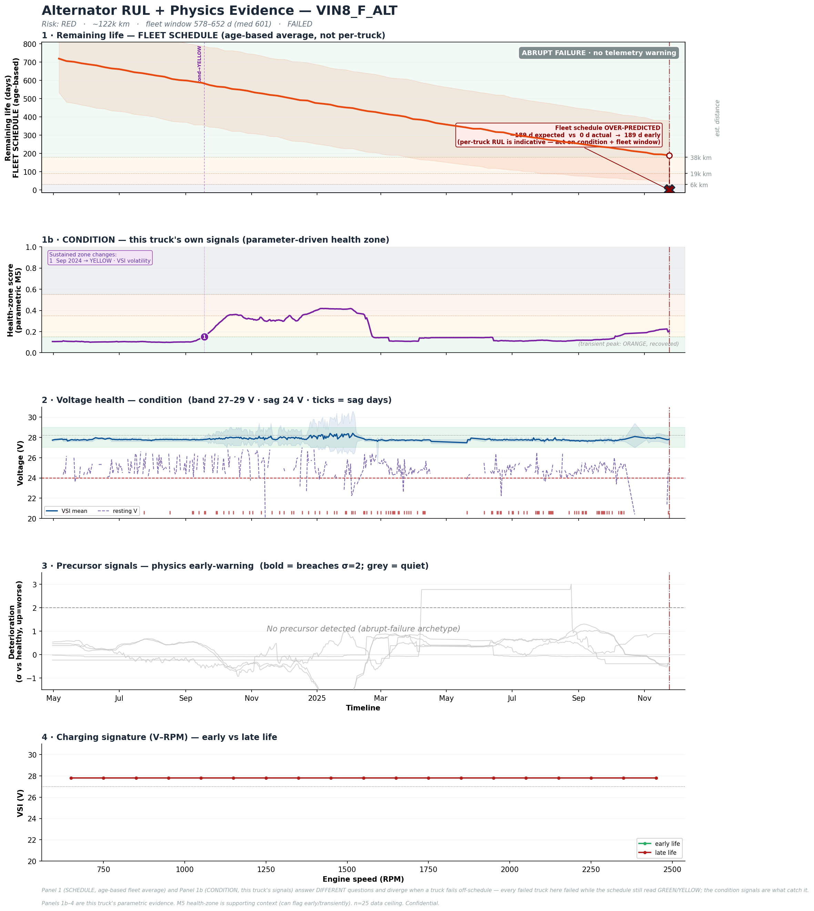

**In simple terms.** **VIN8_F_ALT** is a truck that **failed**. On the fleet's wear-out clock it still looked like it had ~189 days of life at last contact (clock zone **GREEN**). It gave no early electrical warning — it failed quietly, with the sensors looking normal until the end. Its charging voltage held steady to the end. Critically, the fleet schedule still expected ~189 more days at that point — it **over-predicted by ~189 days** because this truck failed early; that gap is why we report a fleet window, not a per-truck day-count.

**Technically.** Risk band **red**; est. ~122k km; fleet wear-out window 578–652 d (median 601). Parametric M5 health-zone transitions: Sep 2024→YELLOW (driver: VSI volatility); final M5 zone **YELLOW**. No signal is elevated at the end (σ<2) — no genuine precursor. M5 transiently peaked at ORANGE then recovered (not a sustained zone change). Schedule over-prediction: fleet clock RUL@last 189 d vs 0 d to actual failure → over by ~189 d (clock zone GREEN at failure). Charging ceiling (≥1500 rpm) early→late Δ = +0.00 V (stable regulation). RUL clock never crossed a lower zone before failure — it failed while the schedule still read **GREEN** (clock ≠ physics).

**Key insights.**
- **Hardest case — silent failure.** No precursor and no parametric zone change; only the fleet replacement window protects this truck. Confirms the abrupt-failure archetype.
- **Clock ≠ physics.** It failed while the RUL schedule still read GREEN — the parameters (M5 / precursors), not the calendar, are what flagged the risk.
- **Parametric driver:** the worst health-zone step (YELLOW, Sep 2024) was driven by **VSI volatility** — the signal to watch on this truck.

**Snapshot — every component at each key moment (read down a column):**

| Component | Early (2024-06-29) | Cond→ORANGE (2024-10-10) | Failure (2025-11-24) |
|---|---|---|---|
| Effective zone | GREEN | YELLOW | YELLOW |
| RUL (schedule) | 663 d (GREEN) | 559 d (GREEN) | 189 d (GREEN) |
| Condition (M5) | 0.11 (GREEN) | 0.35 (ORANGE) | 0.21 (YELLOW) |
| VSI mean | 27.8 V | 27.9 V | 27.8 V |
| Resting V | 25.0 V | 26.8 V | 24.9 V |
| Sag rate | 0.00 | 0.00 | 0.00 |
| Crank-recovery | -0.2σ | -0.2σ | -0.4σ |
| Reg. ceiling | +0.3σ | -0.5σ | -0.4σ |
| GED2 | — | — | — |

### VIN9_F_ALT  ·  _Silent / abrupt failure_

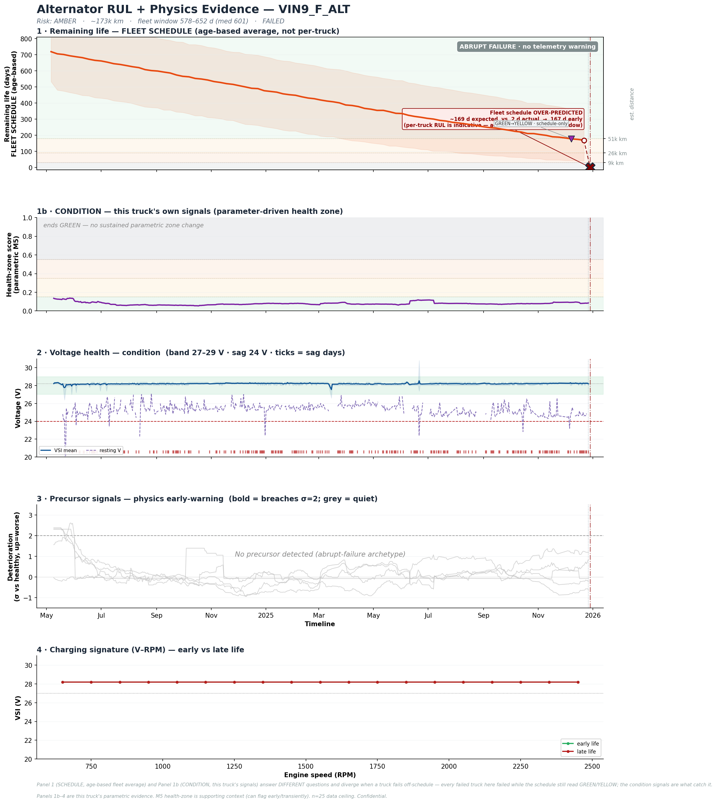

**In simple terms.** **VIN9_F_ALT** is a truck that **failed**. On the fleet's wear-out clock it still looked like it had ~169 days of life at last contact (clock zone **YELLOW**). It gave no early electrical warning — it failed quietly, with the sensors looking normal until the end. Its charging voltage held steady to the end. Critically, the fleet schedule still expected ~169 more days at that point — it **over-predicted by ~167 days** because this truck failed early; that gap is why we report a fleet window, not a per-truck day-count.

**Technically.** Risk band **amber**; est. ~173k km; fleet wear-out window 578–652 d (median 601). M5 health-zone stayed **GREEN** throughout (no parametric transition). No signal is elevated at the end (σ<2) — no genuine precursor. Schedule over-prediction: fleet clock RUL@last 169 d vs 2 d to actual failure → over by ~167 d (clock zone YELLOW at failure). Charging ceiling (≥1500 rpm) early→late Δ = +0.00 V (stable regulation). RUL-clock crossings: GREEN→YELLOW (schedule-only).

**Key insights.**
- **Hardest case — silent failure.** No precursor and no parametric zone change; only the fleet replacement window protects this truck. Confirms the abrupt-failure archetype.

**Snapshot — every component at each key moment (read down a column):**

| Component | Early (2024-06-29) | Failure (2025-12-29) |
|---|---|---|
| Effective zone | GREEN | YELLOW |
| RUL (schedule) | 663 d (GREEN) | 169 d (YELLOW) |
| Condition (M5) | 0.09 (GREEN) | 0.09 (GREEN) |
| VSI mean | 28.1 V | 28.2 V |
| Resting V | 24.3 V | nan V |
| Sag rate | 0.00 | 0.00 |
| Crank-recovery | -0.0σ | -0.1σ |
| Reg. ceiling | +0.4σ | -0.2σ |
| GED2 | — | — |

### VIN10_F_ALT  ·  _Early-warning (GED2 storm ~1d)_

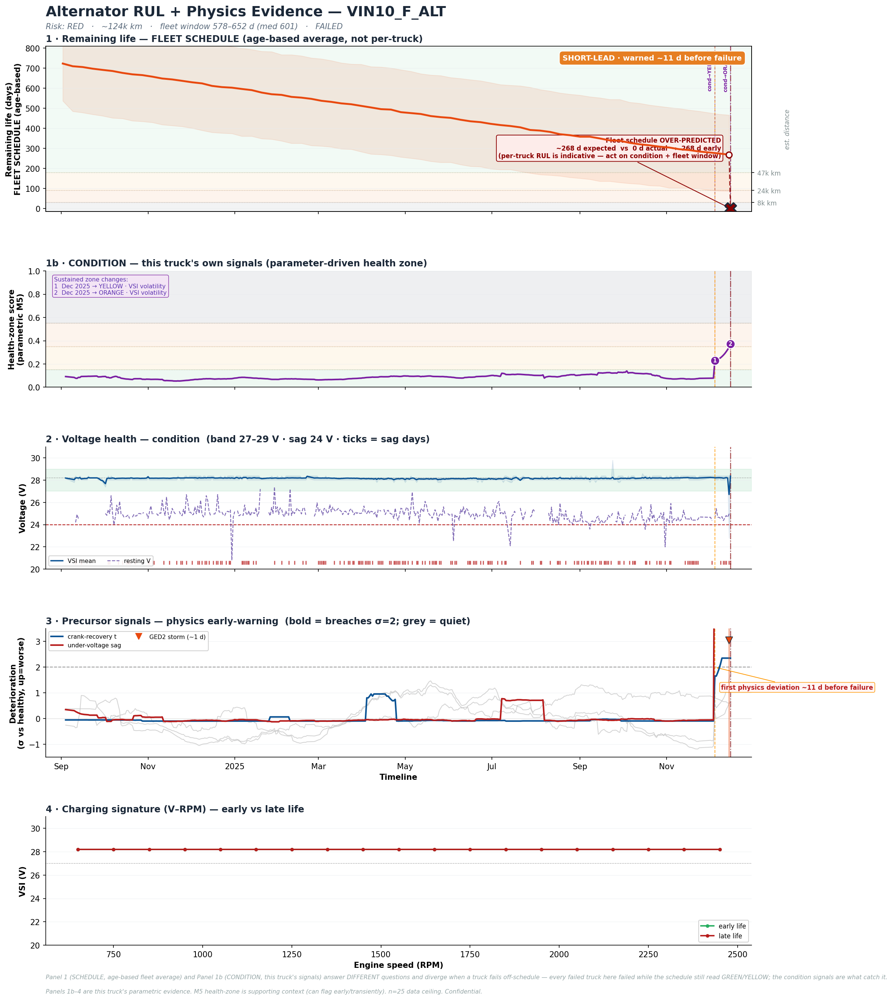

**In simple terms.** **VIN10_F_ALT** is a truck that **failed**. On the fleet's wear-out clock it still looked like it had ~268 days of life at last contact (clock zone **GREEN**). It gave an early electrical warning: the crank-recovery t signal stood out about 11 days before it failed. The excitation-fault 'storm' also fired about 1 days ahead — a rare, high-confidence alarm. Its charging voltage held steady to the end. Critically, the fleet schedule still expected ~268 more days at that point — it **over-predicted by ~268 days** because this truck failed early; that gap is why we report a fleet window, not a per-truck day-count.

**Technically.** Risk band **red**; est. ~124k km; fleet wear-out window 578–652 d (median 601). Parametric M5 health-zone transitions: Dec 2025→YELLOW (driver: VSI volatility); Dec 2025→ORANGE (driver: VSI volatility); final M5 zone **ORANGE**. Signals genuinely elevated at failure (σ≥2 at the end): crank-recovery t (run-up ~11 d), under-voltage sag (run-up ~11 d). Schedule over-prediction: fleet clock RUL@last 268 d vs 0 d to actual failure → over by ~268 d (clock zone GREEN at failure). GED2 excitation storm fired (~1 d lead). Charging ceiling (≥1500 rpm) early→late Δ = +0.00 V (stable regulation). RUL clock never crossed a lower zone before failure — it failed while the schedule still read **GREEN** (clock ≠ physics).

**Key insights.**
- **Actionable signature.** The GED2 storm gives ~1 d notice — the one archetype where a short-horizon pager is viable; deploy the GED channel for trucks like this.
- **Physics led the schedule.** crank-recovery t deviated ~11 d before failure — earlier evidence than the fleet clock provided.
- **Clock ≠ physics.** It failed while the RUL schedule still read GREEN — the parameters (M5 / precursors), not the calendar, are what flagged the risk.
- **Parametric driver:** the worst health-zone step (ORANGE, Dec 2025) was driven by **VSI volatility** — the signal to watch on this truck.

**Snapshot — every component at each key moment (read down a column):**

| Component | Early (2024-10-30) | First deviation (2025-12-05) | Cond→ORANGE (2025-12-16) | Failure (2025-12-16) |
|---|---|---|---|---|
| Effective zone | GREEN | GREEN | GREEN | GREEN |
| RUL (schedule) | 663 d (GREEN) | 277 d (GREEN) | 268 d (GREEN) | 268 d (GREEN) |
| Condition (M5) | 0.07 (GREEN) | 0.23 (YELLOW) | 0.37 (ORANGE) | 0.37 (ORANGE) |
| VSI mean | 28.2 V | 28.2 V | 28.4 V | 28.4 V |
| Resting V | nan V | 24.6 V | 24.8 V | 24.8 V |
| Sag rate | 0.00 | 0.00 | 0.00 | 0.00 |
| Crank-recovery | -0.1σ | +1.7σ | +2.4σ | +2.4σ |
| Reg. ceiling | -0.2σ | +0.2σ | +0.7σ | +0.7σ |
| GED2 | — | — | STORM | STORM |

### VIN11_NF_ALT  ·  _In-service — quiet_

**In simple terms.** **VIN11_NF_ALT** is **still in service**. The fleet clock estimates roughly **97 days** of life remaining. Right now all its signals are calm — routine monitoring against the ~601-day fleet window.

**Technically.** Risk band **green**; est. ~123k km; fleet wear-out window 578–652 d (median 601). M5 health-zone stayed **GREEN** throughout (no parametric transition). No signal is elevated at the end (σ<2) — no genuine precursor. Charging ceiling (≥1500 rpm) early→late Δ = +0.20 V (stable regulation).

**Key insights.**
- **Routine.** No actionable signal; follow the 578–652 d fleet window. RUL *band* (not the point estimate) is the trustworthy output.

**Snapshot — every component at each key moment (read down a column):**

| Component | Early (2024-04-02) | Now (2026-02-18) |
|---|---|---|
| Effective zone | GREEN | YELLOW |
| RUL (schedule) | 663 d (GREEN) | 96 d (YELLOW) |
| Condition (M5) | 0.12 (GREEN) | 0.07 (GREEN) |
| VSI mean | 28.1 V | 28.2 V |
| Resting V | 24.8 V | nan V |
| Sag rate | 0.00 | 0.00 |
| Crank-recovery | -0.0σ | +0.9σ |
| Reg. ceiling | -0.6σ | -2.0σ |
| GED2 | — | — |

### VIN12_NF_ALT  ·  _In-service — quiet_

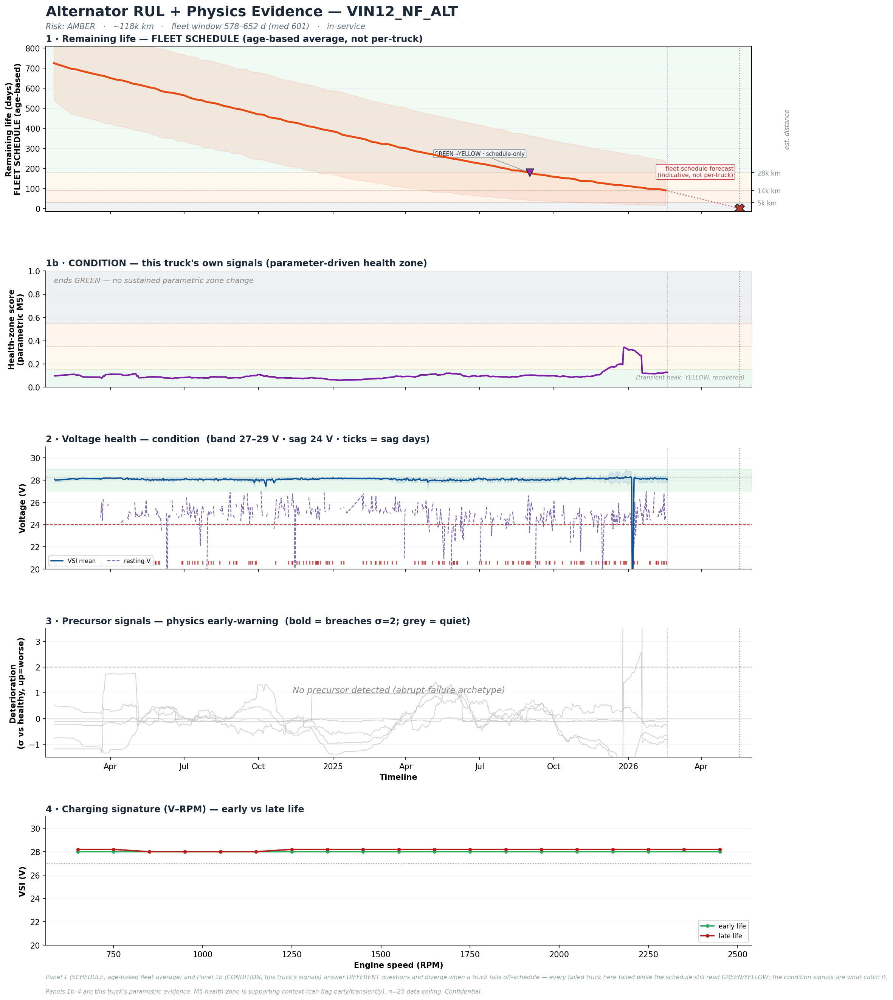

**In simple terms.** **VIN12_NF_ALT** is **still in service**. The fleet clock estimates roughly **90 days** of life remaining. Right now all its signals are calm — routine monitoring against the ~601-day fleet window.

**Technically.** Risk band **amber**; est. ~118k km; fleet wear-out window 578–652 d (median 601). M5 health-zone stayed **GREEN** throughout (no parametric transition). No signal is elevated at the end (σ<2) — no genuine precursor. M5 transiently peaked at YELLOW then recovered (not a sustained zone change). Charging ceiling (≥1500 rpm) early→late Δ = +0.20 V (stable regulation).

**Key insights.**
- **Routine.** No actionable signal; follow the 578–652 d fleet window. RUL *band* (not the point estimate) is the trustworthy output.

**Snapshot — every component at each key moment (read down a column):**

| Component | Early (2024-03-22) | Now (2026-02-18) |
|---|---|---|
| Effective zone | GREEN | YELLOW |
| RUL (schedule) | 663 d (GREEN) | 90 d (YELLOW) |
| Condition (M5) | 0.08 (GREEN) | 0.13 (GREEN) |
| VSI mean | 28.1 V | 28.1 V |
| Resting V | 24.4 V | nan V |
| Sag rate | 0.00 | 0.00 |
| Crank-recovery | -0.1σ | -0.1σ |
| Reg. ceiling | -1.1σ | -0.6σ |
| GED2 | — | — |

### VIN13_NF_ALT  ·  _In-service — quiet_

**In simple terms.** **VIN13_NF_ALT** is **still in service**. The fleet clock estimates roughly **116 days** of life remaining. Right now all its signals are calm — routine monitoring against the ~601-day fleet window.

**Technically.** Risk band **amber**; est. ~132k km; fleet wear-out window 578–652 d (median 601). M5 health-zone stayed **GREEN** throughout (no parametric transition). No signal is elevated at the end (σ<2) — no genuine precursor. M5 transiently peaked at YELLOW then recovered (not a sustained zone change). Charging ceiling (≥1500 rpm) early→late Δ = +0.00 V (stable regulation).

**Key insights.**
- **Routine.** No actionable signal; follow the 578–652 d fleet window. RUL *band* (not the point estimate) is the trustworthy output.

**Snapshot — every component at each key moment (read down a column):**

| Component | Early (2024-05-21) | Now (2026-02-13) |
|---|---|---|
| Effective zone | GREEN | YELLOW |
| RUL (schedule) | 652 d (GREEN) | 121 d (YELLOW) |
| Condition (M5) | 0.13 (GREEN) | 0.11 (GREEN) |
| VSI mean | 27.9 V | 28.0 V |
| Resting V | nan V | 26.1 V |
| Sag rate | 0.00 | 0.00 |
| Crank-recovery | -0.1σ | -0.1σ |
| Reg. ceiling | +0.5σ | -0.6σ |
| GED2 | — | — |

### VIN14_NF_ALT  ·  _In-service — quiet_

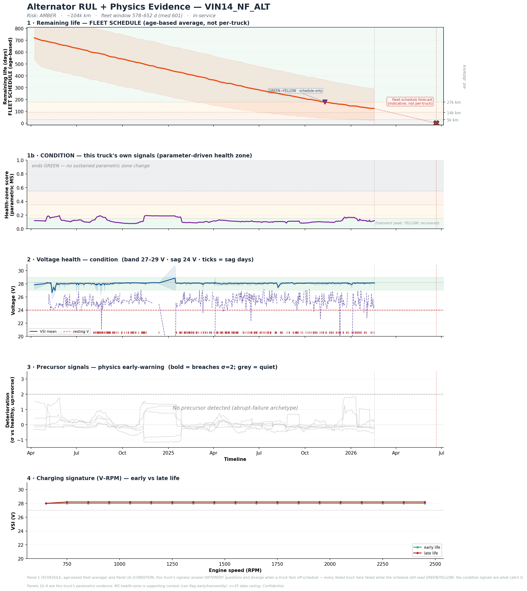

**In simple terms.** **VIN14_NF_ALT** is **still in service**. The fleet clock estimates roughly **124 days** of life remaining. Right now all its signals are calm — routine monitoring against the ~601-day fleet window.

**Technically.** Risk band **amber**; est. ~104k km; fleet wear-out window 578–652 d (median 601). M5 health-zone stayed **GREEN** throughout (no parametric transition). No signal is elevated at the end (σ<2) — no genuine precursor. M5 transiently peaked at YELLOW then recovered (not a sustained zone change). Charging ceiling (≥1500 rpm) early→late Δ = +0.20 V (stable regulation).

**Key insights.**
- **Routine.** No actionable signal; follow the 578–652 d fleet window. RUL *band* (not the point estimate) is the trustworthy output.

**Snapshot — every component at each key moment (read down a column):**

| Component | Early (2024-06-02) | Now (2026-02-17) |
|---|---|---|
| Effective zone | GREEN | YELLOW |
| RUL (schedule) | 661 d (GREEN) | 124 d (YELLOW) |
| Condition (M5) | 0.12 (GREEN) | 0.12 (GREEN) |
| VSI mean | 28.0 V | 28.1 V |
| Resting V | 24.6 V | 24.4 V |
| Sag rate | 0.00 | 0.00 |
| Crank-recovery | -0.1σ | -0.1σ |
| Reg. ceiling | +0.3σ | -0.3σ |
| GED2 | — | — |

### VIN15_NF_ALT  ·  _In-service — quiet_

**In simple terms.** **VIN15_NF_ALT** is **still in service**. The fleet clock estimates roughly **106 days** of life remaining. Right now all its signals are calm — routine monitoring against the ~601-day fleet window.

**Technically.** Risk band **green**; est. ~115k km; fleet wear-out window 578–652 d (median 601). M5 health-zone stayed **GREEN** throughout (no parametric transition). No signal is elevated at the end (σ<2) — no genuine precursor. M5 transiently peaked at YELLOW then recovered (not a sustained zone change). Charging ceiling (≥1500 rpm) early→late Δ = +0.20 V (stable regulation).

**Key insights.**
- **Routine.** No actionable signal; follow the 578–652 d fleet window. RUL *band* (not the point estimate) is the trustworthy output.

**Snapshot — every component at each key moment (read down a column):**

| Component | Early (2024-04-28) | Now (2026-02-18) |
|---|---|---|
| Effective zone | GREEN | YELLOW |
| RUL (schedule) | 663 d (GREEN) | 107 d (YELLOW) |
| Condition (M5) | 0.11 (GREEN) | 0.08 (GREEN) |
| VSI mean | 28.2 V | 28.2 V |
| Resting V | nan V | 24.8 V |
| Sag rate | 0.00 | 0.00 |
| Crank-recovery | -0.0σ | -0.1σ |
| Reg. ceiling | -1.1σ | -1.8σ |
| GED2 | — | — |

### VIN16_NF_ALT  ·  _In-service — quiet_

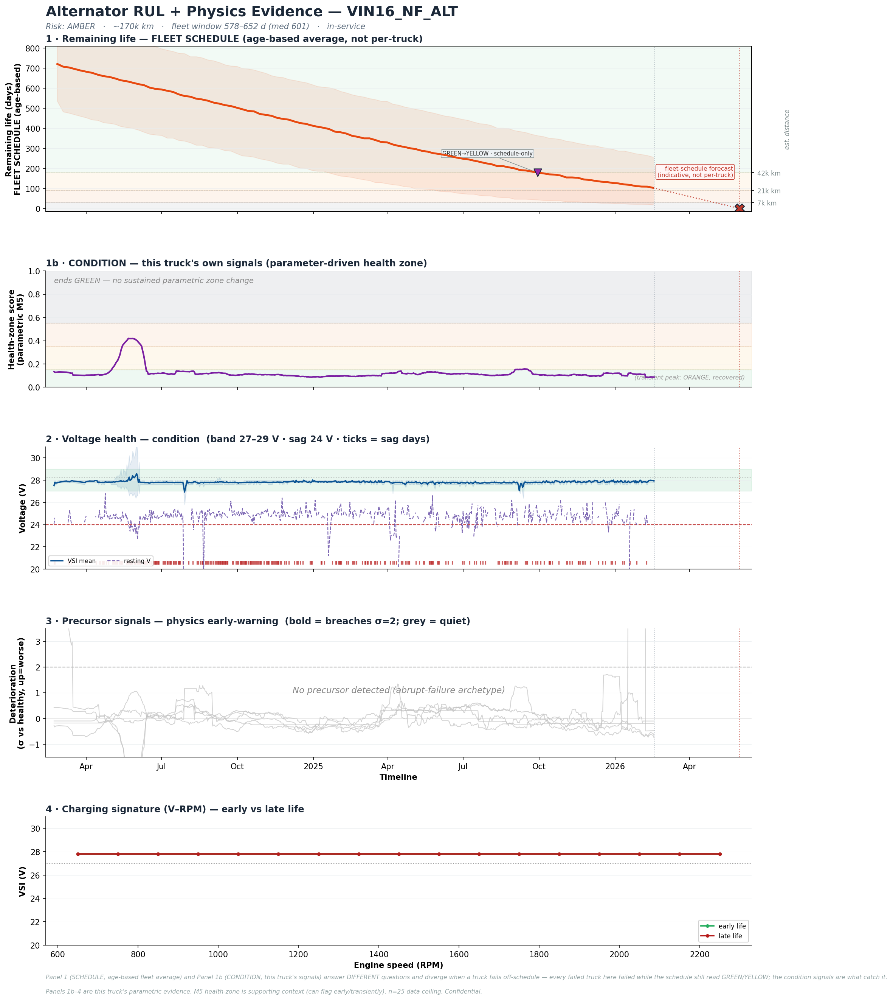

**In simple terms.** **VIN16_NF_ALT** is **still in service**. The fleet clock estimates roughly **102 days** of life remaining. Right now all its signals are calm — routine monitoring against the ~601-day fleet window.

**Technically.** Risk band **amber**; est. ~170k km; fleet wear-out window 578–652 d (median 601). M5 health-zone stayed **GREEN** throughout (no parametric transition). No signal is elevated at the end (σ<2) — no genuine precursor. M5 transiently peaked at ORANGE then recovered (not a sustained zone change). Charging ceiling (≥1500 rpm) early→late Δ = +0.00 V (stable regulation).

**Key insights.**
- **Routine.** No actionable signal; follow the 578–652 d fleet window. RUL *band* (not the point estimate) is the trustworthy output.

**Snapshot — every component at each key moment (read down a column):**

| Component | Early (2024-04-22) | Cond→ORANGE (2024-05-15) | Now (2026-02-18) |
|---|---|---|---|
| Effective zone | GREEN | GREEN | YELLOW |
| RUL (schedule) | 660 d (GREEN) | 638 d (GREEN) | 103 d (YELLOW) |
| Condition (M5) | 0.11 (GREEN) | 0.36 (ORANGE) | 0.09 (GREEN) |
| VSI mean | 27.8 V | 27.9 V | 27.9 V |
| Resting V | 24.7 V | 25.1 V | nan V |
| Sag rate | 0.00 | 0.00 | 0.00 |
| Crank-recovery | -0.2σ | -0.0σ | -0.2σ |
| Reg. ceiling | +0.1σ | -1.1σ | -0.7σ |
| GED2 | — | — | — |

### VIN17_NF_ALT  ·  _In-service — quiet_

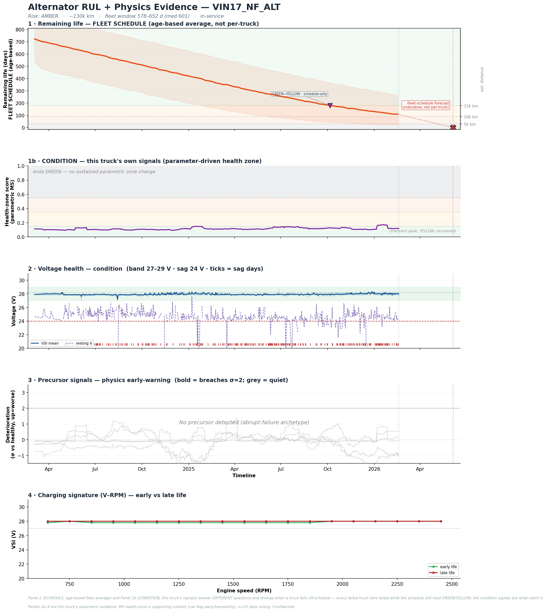

**In simple terms.** **VIN17_NF_ALT** is **still in service**. The fleet clock estimates roughly **106 days** of life remaining. Right now all its signals are calm — routine monitoring against the ~601-day fleet window.

**Technically.** Risk band **amber**; est. ~130k km; fleet wear-out window 578–652 d (median 601). M5 health-zone stayed **GREEN** throughout (no parametric transition). No signal is elevated at the end (σ<2) — no genuine precursor. M5 transiently peaked at YELLOW then recovered (not a sustained zone change). Charging ceiling (≥1500 rpm) early→late Δ = +0.00 V (stable regulation).

**Key insights.**
- **Routine.** No actionable signal; follow the 578–652 d fleet window. RUL *band* (not the point estimate) is the trustworthy output.

**Snapshot — every component at each key moment (read down a column):**

| Component | Early (2024-04-30) | Now (2026-02-18) |
|---|---|---|
| Effective zone | GREEN | YELLOW |
| RUL (schedule) | 661 d (GREEN) | 109 d (YELLOW) |
| Condition (M5) | 0.10 (GREEN) | 0.12 (GREEN) |
| VSI mean | 27.9 V | 27.9 V |
| Resting V | 24.4 V | nan V |
| Sag rate | 0.00 | 0.00 |
| Crank-recovery | -0.1σ | +0.5σ |
| Reg. ceiling | -0.1σ | -0.8σ |
| GED2 | — | — |

### VIN18_NF_ALT  ·  _In-service — quiet_

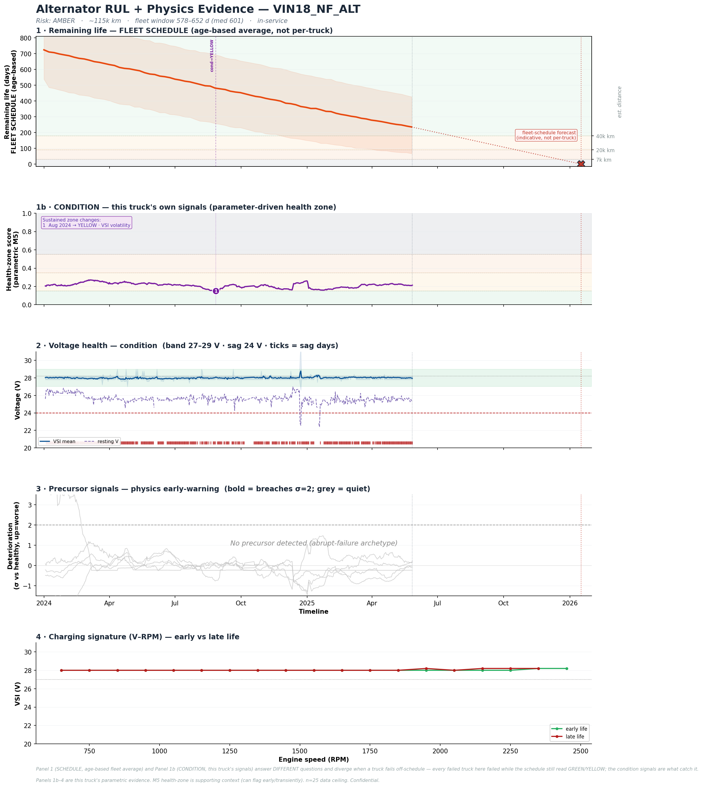

**In simple terms.** **VIN18_NF_ALT** is **still in service**. The fleet clock estimates roughly **234 days** of life remaining. Right now all its signals are calm — routine monitoring against the ~601-day fleet window.

**Technically.** Risk band **amber**; est. ~115k km; fleet wear-out window 578–652 d (median 601). Parametric M5 health-zone transitions: Aug 2024→YELLOW (driver: VSI volatility); final M5 zone **YELLOW**. No signal is elevated at the end (σ<2) — no genuine precursor. Charging ceiling (≥1500 rpm) early→late Δ = +0.00 V (stable regulation).

**Key insights.**
- **Routine.** No actionable signal; follow the 578–652 d fleet window. RUL *band* (not the point estimate) is the trustworthy output.

**Snapshot — every component at each key moment (read down a column):**

| Component | Early (2024-02-29) | Now (2025-05-27) |
|---|---|---|
| Effective zone | YELLOW | YELLOW |
| RUL (schedule) | 663 d (GREEN) | 235 d (GREEN) |
| Condition (M5) | 0.26 (YELLOW) | 0.21 (YELLOW) |
| VSI mean | 27.9 V | 28.0 V |
| Resting V | 25.7 V | 25.3 V |
| Sag rate | 0.01 | 0.00 |
| Crank-recovery | +1.1σ | -0.2σ |
| Reg. ceiling | +0.0σ | -0.1σ |
| GED2 | — | — |

### VIN19_NF_ALT  ·  _In-service — quiet_

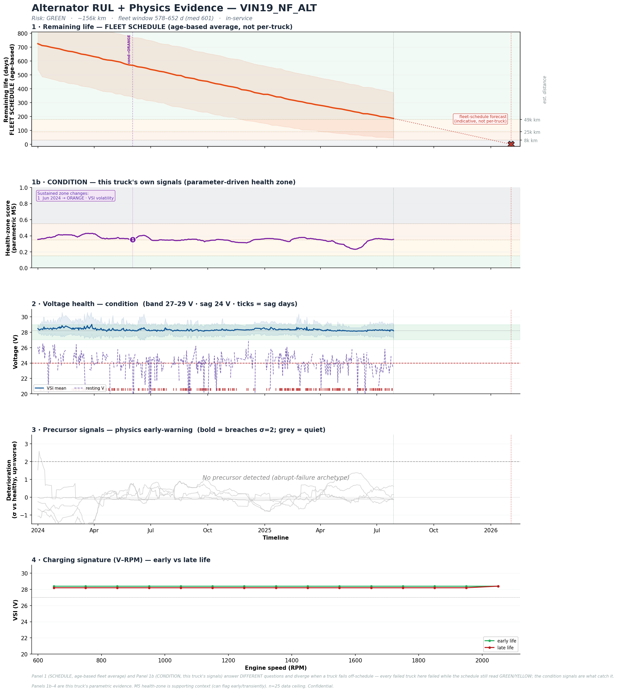

**In simple terms.** **VIN19_NF_ALT** is **still in service**. The fleet clock estimates roughly **190 days** of life remaining. Right now all its signals are calm — routine monitoring against the ~601-day fleet window.

**Technically.** Risk band **green**; est. ~156k km; fleet wear-out window 578–652 d (median 601). Parametric M5 health-zone transitions: Jun 2024→ORANGE (driver: VSI volatility); final M5 zone **ORANGE**. No signal is elevated at the end (σ<2) — no genuine precursor. Charging ceiling (≥1500 rpm) early→late Δ = -0.20 V (stable regulation).

**Key insights.**
- **Routine.** No actionable signal; follow the 578–652 d fleet window. RUL *band* (not the point estimate) is the trustworthy output.

**Snapshot — every component at each key moment (read down a column):**

| Component | Cond→ORANGE (2024-01-01) | Early (2024-03-01) | Now (2025-07-28) |
|---|---|---|---|
| Effective zone | GREEN | ORANGE | YELLOW |
| RUL (schedule) | 725 d (GREEN) | 663 d (GREEN) | 186 d (GREEN) |
| Condition (M5) | 0.36 (ORANGE) | 0.40 (ORANGE) | 0.36 (ORANGE) |
| VSI mean | 28.5 V | 28.5 V | 28.2 V |
| Resting V | 26.1 V | 24.7 V | nan V |
| Sag rate | 0.00 | 0.00 | 0.00 |
| Crank-recovery | +1.5σ | +0.8σ | -0.1σ |
| Reg. ceiling | -0.2σ | -0.8σ | -0.1σ |
| GED2 | — | — | — |

### VIN20_NF_ALT  ·  _In-service — quiet_

**In simple terms.** **VIN20_NF_ALT** is **still in service**. The fleet clock estimates roughly **88 days** of life remaining. Right now all its signals are calm — routine monitoring against the ~601-day fleet window.

**Technically.** Risk band **amber**; est. ~117k km; fleet wear-out window 578–652 d (median 601). M5 health-zone stayed **GREEN** throughout (no parametric transition). No signal is elevated at the end (σ<2) — no genuine precursor. M5 transiently peaked at ORANGE then recovered (not a sustained zone change). Charging ceiling (≥1500 rpm) early→late Δ = +0.10 V (stable regulation).

**Key insights.**
- **Routine.** No actionable signal; follow the 578–652 d fleet window. RUL *band* (not the point estimate) is the trustworthy output.

**Snapshot — every component at each key moment (read down a column):**

| Component | Early (2024-03-19) | Cond→ORANGE (2025-08-09) | Now (2026-02-18) |
|---|---|---|---|
| Effective zone | GREEN | YELLOW | YELLOW |
| RUL (schedule) | 661 d (GREEN) | 190 d (GREEN) | 92 d (YELLOW) |
| Condition (M5) | 0.07 (GREEN) | 0.35 (ORANGE) | 0.10 (GREEN) |
| VSI mean | 28.4 V | 28.0 V | 28.1 V |
| Resting V | nan V | nan V | nan V |
| Sag rate | 0.00 | 0.00 | 0.00 |
| Crank-recovery | -0.1σ | +0.7σ | -0.1σ |
| Reg. ceiling | -1.0σ | -1.2σ | -0.4σ |
| GED2 | — | — | — |

### VIN21_NF_ALT  ·  _In-service — quiet_

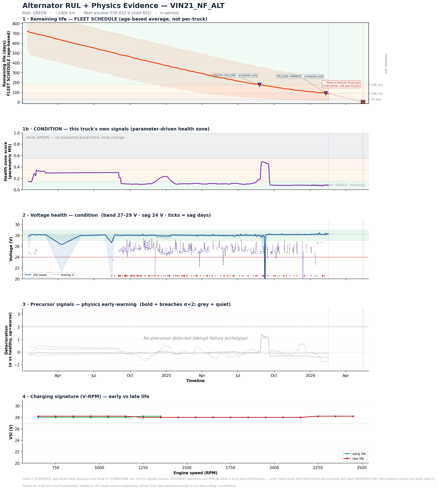

**In simple terms.** **VIN21_NF_ALT** is **still in service**. The fleet clock estimates roughly **87 days** of life remaining. Right now all its signals are calm — routine monitoring against the ~601-day fleet window.

**Technically.** Risk band **green**; est. ~140k km; fleet wear-out window 578–652 d (median 601). M5 health-zone stayed **GREEN** throughout (no parametric transition). No signal is elevated at the end (σ<2) — no genuine precursor. M5 transiently peaked at ORANGE then recovered (not a sustained zone change). Charging ceiling (≥1500 rpm) early→late Δ = +0.00 V (stable regulation).

**Key insights.**
- **Routine.** No actionable signal; follow the 578–652 d fleet window. RUL *band* (not the point estimate) is the trustworthy output.

**Snapshot — every component at each key moment (read down a column):**

| Component | Early (2024-03-12) | Cond→ORANGE (2025-08-29) | Now (2026-02-16) |
|---|---|---|---|
| Effective zone | YELLOW | ORANGE | ORANGE |
| RUL (schedule) | 675 d (GREEN) | 174 d (YELLOW) | 88 d (ORANGE) |
| Condition (M5) | 0.29 (YELLOW) | 0.43 (ORANGE) | 0.08 (GREEN) |
| VSI mean | 28.1 V | 27.9 V | 28.3 V |
| Resting V | nan V | 25.0 V | 25.2 V |
| Sag rate | 0.00 | 0.00 | 0.00 |
| Crank-recovery | -0.1σ | -0.1σ | -0.1σ |
| Reg. ceiling | -0.2σ | +1.3σ | -0.4σ |
| GED2 | — | — | — |

### VIN22_NF_ALT  ·  _In-service — quiet_

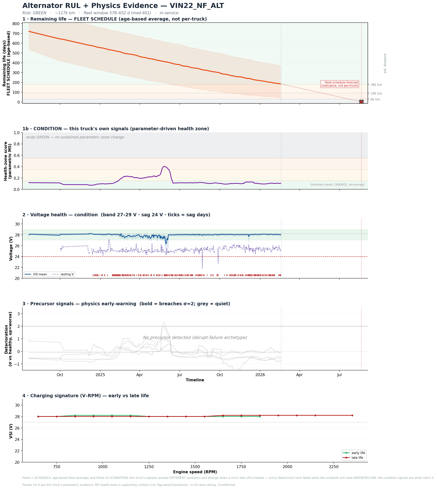

**In simple terms.** **VIN22_NF_ALT** is **still in service**. The fleet clock estimates roughly **183 days** of life remaining. Right now all its signals are calm — routine monitoring against the ~601-day fleet window.

**Technically.** Risk band **green**; est. ~117k km; fleet wear-out window 578–652 d (median 601). M5 health-zone stayed **GREEN** throughout (no parametric transition). No signal is elevated at the end (σ<2) — no genuine precursor. M5 transiently peaked at ORANGE then recovered (not a sustained zone change). Charging ceiling (≥1500 rpm) early→late Δ = +0.20 V (stable regulation).

**Key insights.**
- **Routine.** No actionable signal; follow the 578–652 d fleet window. RUL *band* (not the point estimate) is the trustworthy output.

**Snapshot — every component at each key moment (read down a column):**

| Component | Early (2024-09-15) | Cond→ORANGE (2025-05-22) | Now (2026-02-18) |
|---|---|---|---|
| Effective zone | GREEN | YELLOW | GREEN |
| RUL (schedule) | 644 d (GREEN) | 416 d (GREEN) | 185 d (GREEN) |
| Condition (M5) | 0.11 (GREEN) | 0.36 (ORANGE) | 0.11 (GREEN) |
| VSI mean | 27.9 V | 27.4 V | 28.0 V |
| Resting V | 24.4 V | 25.9 V | 25.3 V |
| Sag rate | 0.00 | 0.00 | 0.00 |
| Crank-recovery | -0.1σ | +1.0σ | -0.1σ |
| Reg. ceiling | -0.5σ | +1.8σ | -0.4σ |
| GED2 | — | — | — |

### VIN23_NF_ALT  ·  _In-service — quiet_

**In simple terms.** **VIN23_NF_ALT** is **still in service**. The fleet clock estimates roughly **118 days** of life remaining. Right now all its signals are calm — routine monitoring against the ~601-day fleet window.

**Technically.** Risk band **green**; est. ~118k km; fleet wear-out window 578–652 d (median 601). M5 health-zone stayed **GREEN** throughout (no parametric transition). No signal is elevated at the end (σ<2) — no genuine precursor. M5 transiently peaked at YELLOW then recovered (not a sustained zone change). Charging ceiling (≥1500 rpm) early→late Δ = +0.00 V (stable regulation).

**Key insights.**
- **Routine.** No actionable signal; follow the 578–652 d fleet window. RUL *band* (not the point estimate) is the trustworthy output.

**Snapshot — every component at each key moment (read down a column):**

| Component | Early (2024-05-21) | Now (2026-02-11) |
|---|---|---|
| Effective zone | YELLOW | YELLOW |
| RUL (schedule) | 665 d (GREEN) | 120 d (YELLOW) |
| Condition (M5) | 0.18 (YELLOW) | 0.07 (GREEN) |
| VSI mean | 28.2 V | 28.2 V |
| Resting V | nan V | nan V |
| Sag rate | 0.00 | 0.00 |
| Crank-recovery | -0.1σ | -0.1σ |
| Reg. ceiling | -0.7σ | +0.0σ |
| GED2 | — | — |

### VIN24_NF_ALT  ·  _In-service — quiet_

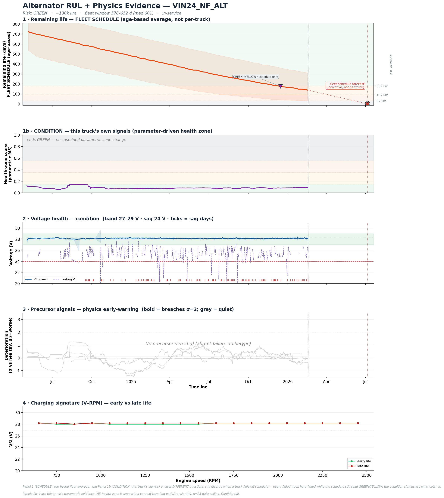

**In simple terms.** **VIN24_NF_ALT** is **still in service**. The fleet clock estimates roughly **138 days** of life remaining. Right now all its signals are calm — routine monitoring against the ~601-day fleet window.

**Technically.** Risk band **green**; est. ~130k km; fleet wear-out window 578–652 d (median 601). M5 health-zone stayed **GREEN** throughout (no parametric transition). No signal is elevated at the end (σ<2) — no genuine precursor. Charging ceiling (≥1500 rpm) early→late Δ = +0.00 V (stable regulation).

**Key insights.**
- **Routine.** No actionable signal; follow the 578–652 d fleet window. RUL *band* (not the point estimate) is the trustworthy output.

**Snapshot — every component at each key moment (read down a column):**

| Component | Early (2024-07-02) | Now (2026-02-18) |
|---|---|---|
| Effective zone | GREEN | YELLOW |
| RUL (schedule) | 657 d (GREEN) | 138 d (YELLOW) |
| Condition (M5) | 0.07 (GREEN) | 0.09 (GREEN) |
| VSI mean | 28.2 V | 28.1 V |
| Resting V | nan V | 25.8 V |
| Sag rate | 0.00 | 0.00 |
| Crank-recovery | -0.2σ | +0.1σ |
| Reg. ceiling | -0.2σ | -0.1σ |
| GED2 | — | — |

### VIN25_NF_ALT  ·  _In-service — quiet_

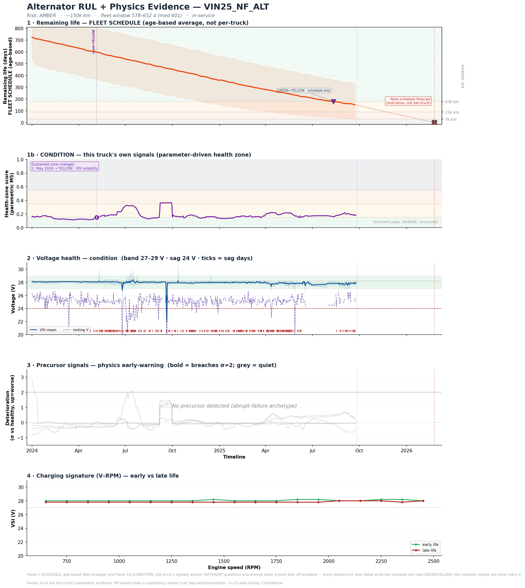

**In simple terms.** **VIN25_NF_ALT** is **still in service**. The fleet clock estimates roughly **151 days** of life remaining. Right now all its signals are calm — routine monitoring against the ~601-day fleet window.

**Technically.** Risk band **amber**; est. ~150k km; fleet wear-out window 578–652 d (median 601). Parametric M5 health-zone transitions: May 2024→YELLOW (driver: VSI volatility); final M5 zone **YELLOW**. No signal is elevated at the end (σ<2) — no genuine precursor. M5 transiently peaked at ORANGE then recovered (not a sustained zone change). Charging ceiling (≥1500 rpm) early→late Δ = -0.20 V (stable regulation).

**Key insights.**
- **Routine.** No actionable signal; follow the 578–652 d fleet window. RUL *band* (not the point estimate) is the trustworthy output.

**Snapshot — every component at each key moment (read down a column):**

| Component | Early (2024-03-01) | Cond→ORANGE (2024-09-07) | Now (2025-09-26) |
|---|---|---|---|
| Effective zone | GREEN | YELLOW | YELLOW |
| RUL (schedule) | 663 d (GREEN) | 475 d (GREEN) | 151 d (YELLOW) |
| Condition (M5) | 0.13 (GREEN) | 0.36 (ORANGE) | 0.18 (YELLOW) |
| VSI mean | 28.1 V | 28.1 V | 28.0 V |
| Resting V | 25.7 V | 24.9 V | 25.5 V |
| Sag rate | 0.00 | 0.00 | 0.00 |
| Crank-recovery | -0.1σ | +1.5σ | -0.0σ |
| Reg. ceiling | -0.3σ | +1.2σ | +0.2σ |
| GED2 | — | — | — |

## Honest limitations
- Per-truck RUL point estimates do not beat the fleet clock (MAE ~140 d vs ~50 d); the **band** and the **601 d / ~120k km window** are the timing deliverables.
- Precursors fire for a minority of failures (GED2 2/10; compound 3/10); most failures are abrupt.
- The M5 health-zone is supporting context only (weak sensitivity, can flag early/transiently).
- All signals carry the n=25 / 10-event data ceiling; figures are decision-support, not guarantees.
