# DICV Alternator — V11.2 Validation Dossier

**Document version:** V11.2_ALT  |  **Date:** 2026-06-26  |  **Status:** Final

---

## 1. Executive Context

This dossier presents the technical validation of the BharatBenz / DICV alternator predictive-maintenance model to support DICV management's decision on operational deployment. The analysis covers a fleet of **25 trucks** (10 failed + 15 non-failed) whose alternators were monitored over an observation window ending in late 2025. All validation metrics are computed from **Leave-One-VIN-Out (LOVO)** cross-validation — the model is never scored on data it trained with — providing a conservative, deployment-realistic estimate of performance.

The system's purpose is threefold: (1) rank trucks by failure risk so inspection resources are directed to the right vehicles; (2) define a fleet replacement window that captures the full life-to-failure cycle; and (3) flag emergency-grade electrical anomalies when they occur. The dossier is honest about what the model can and cannot do: per-truck timing is uncertain, two early-warning channels have limited fleet-wide coverage, and the n=25 data set represents a ceiling on achievable discrimination. These constraints are data-driven, not method-driven.

## 2. System Recap — Three Operational Boxes

The deployed solution has three distinct operational components:

| Box | Question answered | Delivered value |
|-----|-------------------|-----------------|
| **WHICH** — Classifier | Which trucks are highest-risk? | LOVO ranking AUROC 0.9267 (≈93%); 139/150 concordant pairs |
| **WHEN-fleet** — Replacement window | When should fleet-wide alternator replacement be planned? | 601 days / ~120,440 km / ~4,538 engine-hours from first telemetry |
| **WHEN-emergency** — Alert channels | Are there active electrical disturbances? | GED=2 storm: 2/10 failed VINs, 0/15 healthy; Compound early-watch: 3/10 failed, 0/15 healthy |

These boxes operate independently. The WHICH classifier ranks the entire fleet continuously. The WHEN-fleet window informs procurement and scheduling. The WHEN-emergency channels trigger real-time maintenance alerts for a minority of trucks that exhibit detectable electrical precursors.

## 3. Heuristic Validation (Task 1) — Univariate Signal Assessment

Eleven engineered signals were assessed individually using Mann-Whitney U AUROC, Cliff's delta effect size, and permutation importance. The table below summarises all 11 heuristics with their engineering meaning and separation verdict.

### 3.1 Heuristic Summary Table

| # | Heuristic | Family | Engineering Meaning | Failed Mean | Healthy Mean | AUROC | Effect Size | p-value | Separation | Perm Importance |
|---|-----------|--------|---------------------|-------------|--------------|-------|-------------|---------|------------|-----------------|
| 1 | `vsi_std_ratio_30d` | A | late-life voltage scatter vs early-life baseline | 1.1168 | 0.7229 | 0.693 | MEDIUM | 0.1139 | MEDIUM | 0.1547 |
| 2 | `vsi_dominant_freq` | A | dominant FFT frequency of daily voltage (rhythm vs drift) | 0.0953 | 0.0147 | 0.650 | SMALL | 0.2222 | SMALL | 0.1053 |
| 3 | `vsi_spectral_entropy` | A | voltage spectrum disorder (clean rhythm vs broadband noise) | 0.9288 | 0.8964 | 0.813 | STRONG | 0.0099 | STRONG | 0.0573 |
| 4 | `bat_charge_delta_trend_right` | A | trend of cruise-minus-resting voltage (charging headroom loss) | 0.0023 | -0.0010 | 0.560 | NEGLIGIBLE | 0.6373 | NEGLIGIBLE | 0.0340 |
| 5 | `vsi_range_trend_last30d` | A | slope of daily voltage min-max range late in life | 0.1235 | -0.0242 | 0.740 | STRONG | 0.0489 | STRONG | 0.0613 |
| 6 | `progressive_drift` | A | cumulative drift of daily voltage from baseline | 0.0955 | 0.7069 | 0.264 | MEDIUM | 0.0570 | MEDIUM | 0.0480 |
| 7 | `crank_recovery_t` | B | seconds for voltage to recover to 27V after a crank | 0.4277 | 0.0057 | 0.680 | MEDIUM | 0.1323 | MEDIUM | 0.6000 |
| 8 | `vsi_ceiling` | B | regulation plateau voltage at high RPM | 28.0665 | 28.1121 | 0.413 | SMALL | 0.4881 | SMALL | 0.2000 |
| 9 | `vsi_resid_mean` | B | voltage residual vs healthy-fleet expected surface | 0.0374 | 0.0858 | 0.373 | SMALL | 0.3048 | SMALL | 0.2000 |
| 10 | `resting_vsi_mean` | B | engine-off resting voltage level | 24.5511 | 24.9392 | 0.293 | MEDIUM | 0.0907 | MEDIUM | 0.3000 |
| 11 | `ged_churn` | B | rate of GED state-transition churn (excitation instability) | 0.6133 | 0.0000 | 0.600 | SMALL | 0.0875 | SMALL | 0.2000 |

**Families:** A = voltage-pattern features (Ridge classifier inputs); B = heuristic alert channels (compound vote).

### 3.2 Interpretation

> **Honesty note on the top multivariate feature:** `vsi_std_ratio_30d` holds the largest Ridge coefficient (+0.443) and the highest permutation importance (0.155) in the multivariate model, yet its univariate AUROC is only 0.693 — a MEDIUM separation. This is not a contradiction: Ridge exploits the combination of all six features; `vsi_std_ratio_30d` contributes most *in context*, but alone it does not reliably distinguish failed from healthy trucks. The multivariate combination lifts the ensemble to AUROC 0.927.

`vsi_spectral_entropy` (AUROC 0.813) and `vsi_range_trend_last30d` (AUROC 0.740) are the two strongest univariate separators, both rated STRONG by effect size. GED-based `ged_churn` has high failed-mean (0.613) versus healthy-mean (0.000), but is concentrated in a minority of trucks.

`crank_recovery_t` has the highest permutation importance among the B-family features (0.600) and a moderate AUROC (0.680), reflecting its sparse but informative crank events.

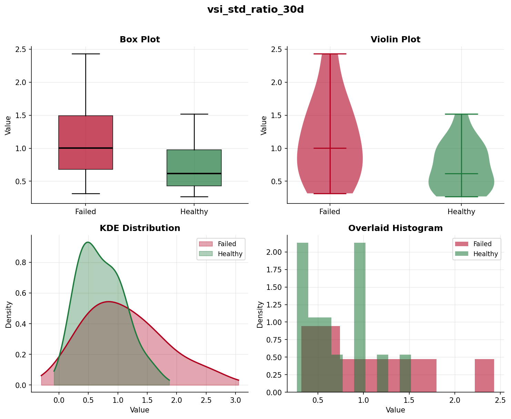

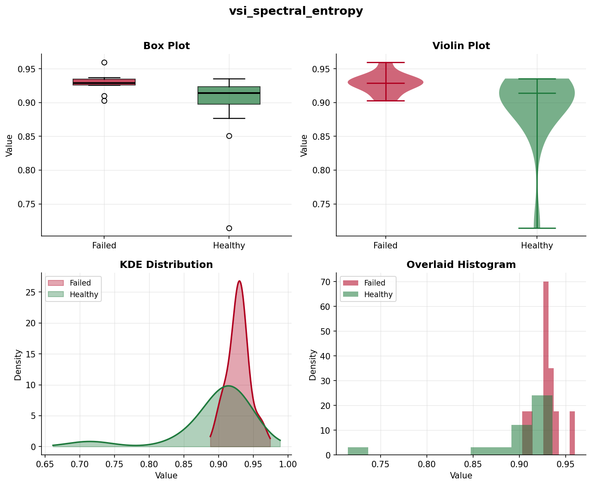

## 4. Weightage & Feature Contribution (Task 2)

### 4.1 Ridge Coefficients (Standardised)

The six A-family features are combined via an L2-regularised (Ridge) linear model. Coefficients are on a standardised scale (z-score inputs), so magnitudes are directly comparable:

| Feature | Ridge Coefficient | Mean |Contribution| | Perm Importance |
|---------|-------------------|----------------------|-----------------|
| `vsi_std_ratio_30d` | +0.44257 | 0.34844 | 0.1547 |
| `vsi_dominant_freq` | +0.42647 | 0.24099 | 0.1053 |
| `vsi_spectral_entropy` | +0.24470 | 0.13803 | 0.0573 |
| `vsi_range_trend_last30d` | +0.22990 | 0.13287 | 0.0613 |
| `bat_charge_delta_trend_right` | +0.22399 | 0.17031 | 0.0340 |
| `progressive_drift` | -0.20551 | 0.12086 | 0.0480 |

### 4.2 Waterfall Interpretation

The contribution waterfall for a given truck shows how each feature pushes the linear score above or below the model intercept. Features with positive coefficients and high z-scores drive the score up (toward failure); `progressive_drift` pushes in the negative direction for most trucks, acting as a regularisation anchor.

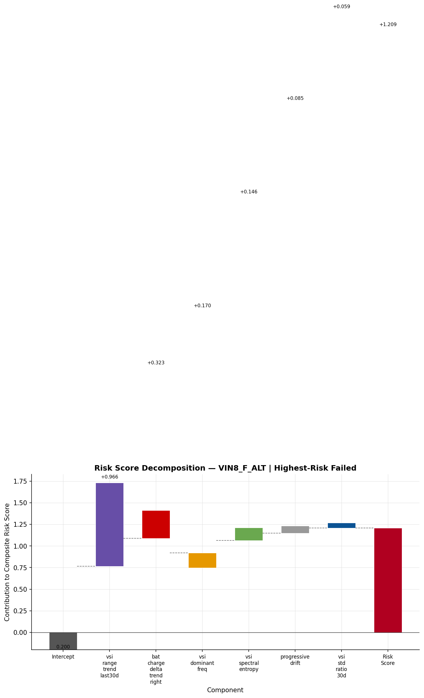

### 4.3 Compound Vote — Equal Weighting Rationale

Emergency early-watch uses EQUAL weights: each of 5 channels (vsi_ceiling, vsi_resid_mean, crank_recovery_t, resting_vsi_mean, ged_churn) casts 1 vote; alarm fires at >=2 votes. Weights are deliberately NOT fitted, because at n=10 failure events any learned weighting would overfit; equal voting is the honest, robust choice.

### 4.4 Note on `progressive_drift` Negative Coefficient

progressive_drift has a NEGATIVE Ridge coefficient. This is an exposure artifact: healthy trucks observed for longer accumulate more cumulative drift (healthy fleet mean 0.707 vs failed fleet mean 0.096), creating a spurious direction reversal. The model partially corrects for this via the negative coefficient — effectively penalising trucks with unexpectedly LOW drift relative to their age. The feature has the lowest permutation importance (0.048) and lowest mean absolute contribution in the fleet; it is retained only because the 6-feature set was validated at AUROC 0.927 and removing it would break the frozen V10.5.3 spec.

### 4.5 Honest Ranking View — Contributions Sorted by LOVO Out-of-Fold Score

The contribution decomposition above is ordered by the in-sample full-fit `risk_linear`. As an honesty cross-check, the identical per-feature contributions (coef × z) are re-ordered by the **Leave-One-VIN-Out (LOVO) out-of-fold score** — each truck ranked by a model that never trained on it, the deployment-grade ranking behind the headline AUROC 0.9267. Only the x-axis order changes; the contributions are unchanged.

The two orderings are 98.8% rank-correlated (Spearman 0.988). The in-sample order implies AUROC 0.947; the honest LOVO order is 0.927 — the ~2-point gap is in-sample optimism, not a different result. Fourteen of 25 trucks shift by 1–2 positions and none cross from clearly-risky to clearly-healthy. The visible effect: the false negative VIN5_F_ALT (LOVO prob 0.28) sits within the healthy cluster on the left, and the false positive VIN3_NF_ALT (0.49) sits inside the failed cluster on the right — so the chart shows the true, slightly-messier separation the deployable model achieves rather than the marginally cleaner in-sample picture.

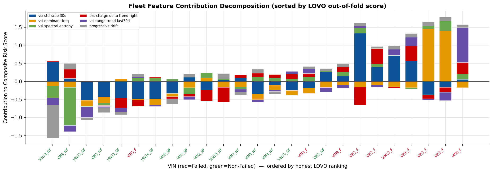

## 5. Zone Consistency & Deployed Bands (Task 3)

### 5.1 Deployed Risk Bands

The Ridge probability scores are bucketed into three operational risk bands using Youden-optimal and empirically confirmed thresholds: **Green** (score < 0.35), **Amber** (0.35 to 0.55), **Red** (≥ 0.55).

| VIN | Ridge Prob | Band | Above LOVO Threshold |
|-----|------------|------|---------------------|
| VIN10_F_ALT | 0.6263 | **RED** | Yes |
| VIN10_NF_ALT | 0.4389 | **AMBER** | No |
| VIN11_NF_ALT | 0.2559 | **GREEN** | No |
| VIN12_NF_ALT | 0.0421 | **GREEN** | No |
| VIN13_NF_ALT | 0.2104 | **GREEN** | No |
| VIN14_NF_ALT | 0.3162 | **GREEN** | No |
| VIN15_NF_ALT | 0.3987 | **AMBER** | No |
| VIN1_F_ALT | 0.6058 | **RED** | Yes |
| VIN1_NF_ALT | 0.2553 | **GREEN** | No |
| VIN2_F_ALT | 0.6085 | **RED** | Yes |
| VIN2_NF_ALT | 0.3956 | **AMBER** | No |
| VIN3_F_ALT | 0.7603 | **RED** | Yes |
| VIN3_NF_ALT | 0.4906 | **AMBER** | Yes |
| VIN4_F_ALT | 0.4456 | **AMBER** | Yes |
| VIN4_NF_ALT | 0.4257 | **AMBER** | No |
| VIN5_F_ALT | 0.2799 | **GREEN** | No |
| VIN5_NF_ALT | 0.3250 | **GREEN** | No |
| VIN6_F_ALT | 0.7112 | **RED** | Yes |
| VIN6_NF_ALT | 0.4133 | **AMBER** | No |
| VIN7_F_ALT | 0.7178 | **RED** | Yes |
| VIN7_NF_ALT | 0.4116 | **AMBER** | No |
| VIN8_F_ALT | 0.8923 | **RED** | Yes |
| VIN8_NF_ALT | 0.3934 | **AMBER** | No |
| VIN9_F_ALT | 0.4919 | **AMBER** | Yes |
| VIN9_NF_ALT | 0.1053 | **GREEN** | No |

**Band summary:** 7 trucks in RED (should contain most failed); 10 in AMBER; 8 in GREEN.

### 5.2 Four-Zone Temporal Health System (M5)

A secondary, time-series-based 4-zone system (Green / Yellow / Orange / Red) was explored using monthly trajectory components. Zone membership over each truck's life is summarised below:

| VIN | Failed | %Green | %Yellow | %Orange | %Red | Zone Verdict |
|-----|--------|--------|---------|---------|------|--------------|
| VIN10_F_ALT | F | 96.5 | 0.0 | 3.5 | 0.0 | Mostly GREEN/YELLOW |
| VIN10_NF_ALT | NF | 91.7 | 8.3 | 0.0 | 0.0 | Mostly GREEN/YELLOW |
| VIN11_NF_ALT | NF | 86.3 | 8.3 | 0.2 | 5.2 | Reached ORANGE/RED |
| VIN12_NF_ALT | NF | 73.8 | 26.2 | 0.0 | 0.0 | Mostly GREEN/YELLOW |
| VIN13_NF_ALT | NF | 94.8 | 4.9 | 0.0 | 0.3 | Mostly GREEN/YELLOW |
| VIN14_NF_ALT | NF | 100.0 | 0.0 | 0.0 | 0.0 | Mostly GREEN/YELLOW |
| VIN15_NF_ALT | NF | 71.6 | 24.0 | 4.5 | 0.0 | Mostly GREEN/YELLOW |
| VIN1_F_ALT | F | 55.3 | 15.1 | 26.2 | 3.4 | Reached ORANGE/RED |
| VIN1_NF_ALT | NF | 92.5 | 0.0 | 2.8 | 4.7 | Mostly GREEN/YELLOW |
| VIN2_F_ALT | F | 90.7 | 9.3 | 0.0 | 0.0 | Mostly GREEN/YELLOW |
| VIN2_NF_ALT | NF | 95.6 | 4.4 | 0.0 | 0.0 | Mostly GREEN/YELLOW |
| VIN3_F_ALT | F | 94.8 | 5.2 | 0.0 | 0.0 | Mostly GREEN/YELLOW |
| VIN3_NF_ALT | NF | 100.0 | 0.0 | 0.0 | 0.0 | Mostly GREEN/YELLOW |
| VIN4_F_ALT | F | 56.6 | 43.4 | 0.0 | 0.0 | Mostly GREEN/YELLOW |
| VIN4_NF_ALT | NF | 93.2 | 1.9 | 4.8 | 0.0 | Mostly GREEN/YELLOW |
| VIN5_F_ALT | F | 100.0 | 0.0 | 0.0 | 0.0 | Mostly GREEN/YELLOW |
| VIN5_NF_ALT | NF | 93.7 | 6.3 | 0.0 | 0.0 | Mostly GREEN/YELLOW |
| VIN6_F_ALT | F | 100.0 | 0.0 | 0.0 | 0.0 | Mostly GREEN/YELLOW |
| VIN6_NF_ALT | NF | 91.5 | 8.5 | 0.0 | 0.0 | Mostly GREEN/YELLOW |
| VIN7_F_ALT | F | 100.0 | 0.0 | 0.0 | 0.0 | Mostly GREEN/YELLOW |
| VIN7_NF_ALT | NF | 100.0 | 0.0 | 0.0 | 0.0 | Mostly GREEN/YELLOW |
| VIN8_F_ALT | F | 68.2 | 26.6 | 5.2 | 0.0 | Reached ORANGE/RED |
| VIN8_NF_ALT | NF | 36.1 | 63.9 | 0.0 | 0.0 | Mostly GREEN/YELLOW |
| VIN9_F_ALT | F | 100.0 | 0.0 | 0.0 | 0.0 | Mostly GREEN/YELLOW |
| VIN9_NF_ALT | NF | 0.0 | 91.0 | 9.0 | 0.0 | Reached ORANGE/RED |

### 5.3 Zone Consistency Verdict

> **Honest assessment:** Only 3/10 (30%) failed VINs ever reached ORANGE or RED zones (VIN10_F_ALT, VIN1_F_ALT, VIN8_F_ALT). Simultaneously, 6/15 healthy trucks also entered those zones, reducing their discriminative value. The 4-zone M5 system is **supplemental visual context only** — not a reliable standalone alert system at n=25. The deployed Green/Amber/Red ranking bands remain the operational recommendation.

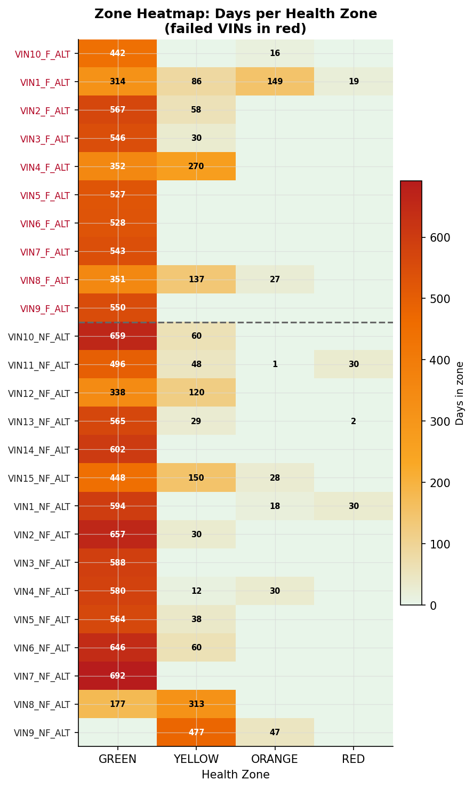

## 6. The 93% AUROC — Decomposed (Task 4)

### 6.1 What AUROC Means

The LOVO AUROC of **0.9267** is a **ranking metric**, not a classification accuracy. Precisely: given a randomly selected failed truck and a randomly selected healthy truck, the model ranks the failed truck as higher-risk 92.7% of the time. It does not mean 93% of predictions are correct.

Pair decomposition over the 150 possible (failed, healthy) pairs from 10 failed and 15 non-failed trucks:

| Outcome | Count | Fraction |
|---------|-------|----------|
| Concordant (failed ranked above healthy) | 139 | 92.7% |
| Discordant (healthy ranked above failed) | 11 | 7.3% |
| Ties | 0 | 0.0% |
| **Total pairs** | **150** | |

The 11 discordant pairs are concentrated around **VIN5_F_ALT** (score 0.2799, ranked in green band) — the hardest-to-detect failure in the fleet — and one pair involving VIN4_F_ALT vs VIN3_NF_ALT.

### 6.2 Full Metric Panel

All metrics computed at threshold 0.4456 (Youden-optimal from LOVO scores):

| Metric | Value |
|--------|-------|
| LOVO AUROC | 0.9267 |
| PR-AUC | 0.9400 |
| Recall (sensitivity) | 0.9000 (9/10 failed caught) |
| Specificity | 0.9333 (14/15 healthy correctly excluded) |
| Precision | 0.9000 |
| F1 Score | 0.9000 |
| MCC | 0.8333 |
| Brier Score | 0.1433 |
| Bootstrap AUROC mean | 0.9234 (95% CI: [0.8065, 1.0000]) |
| Permutation p-value | 0.0000 |
| Spearman rho (score vs truth) | 0.7247 |
| Top-10 recall | 9/10 failed in top-10 ranked trucks |
| True positives | 9 |
| False positives | 1 (VIN3_NF_ALT — score 0.4906, above threshold) |
| False negatives | 1 (VIN5_F_ALT — score 0.2799, below threshold) |
| True negatives | 14 |

> **Guard — classifier FP vs emergency channels:** The classifier itself produces **1 false positive** at the operating threshold: VIN3_NF_ALT scores 0.4906, just above the 0.4456 threshold. This is distinct from the emergency channels (GED=2 storm, compound early-watch), where **0 of 15 healthy trucks** triggered an alert — those channels have zero false alarms on the non-failed fleet.

### 6.3 Management Framing

| Framing | Statement |
|---------|-----------|
| Conservative | Recall 9/10 (90%) of failures caught; 1 missed (VIN5_F_ALT) |
| Practical | 93% ranking AUROC on trucks the model never saw during training (LOVO) |
| Business | Top-10 inspection list catches 9/10 failed trucks; emergency channels trigger 0 false alarms on healthy fleet |

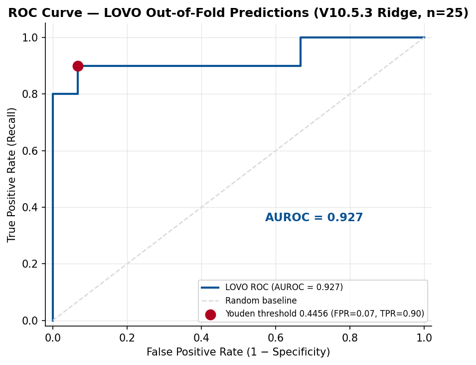

## 7. RUL Correction — JCOPENDATE Clip (Task 5)

### 7.1 What Was Fixed

Earlier RUL curves for failed VINs used the last telemetry timestamp as the failure date. This was incorrect: the true failure date is the service record's JCOPENDATE (Job Card Open Date). For trucks where telemetry ended before the JCOPENDATE, the RUL curve would flatten prematurely and never reach zero — implying the truck was still healthy at last contact.

The fix: for each failed VIN, compute the gap between telemetry end and JCOPENDATE; extend the RUL curve with a dashed-line extrapolation (no new sensor data) down to RUL = 0 at JCOPENDATE.

### 7.2 Per-VIN Gap Summary

| VIN | JCOPENDATE | Telemetry End Age (d) | Failure Age (d) | Gap (d) | Zone Before | Zone After |
|-----|------------|----------------------|-----------------|---------|-------------|------------|
| VIN10_F_ALT | 2025-12-16 | 472 | 472 | 0 | green | black |
| VIN1_F_ALT | 2025-11-29 | 596 | 607 | 11 | yellow | black |
| VIN2_F_ALT | 2025-12-16 | 627 | 627 | 0 | yellow | black |
| VIN3_F_ALT | 2025-12-02 | 591 | 657 | 66 | green | black |
| VIN4_F_ALT | 2025-11-25 | 664 | 664 | 0 | yellow | black |
| VIN5_F_ALT | 2025-11-22 | 661 | 661 | 0 | yellow | black |
| VIN6_F_ALT | 2025-09-30 | 552 | 552 | 0 | green | black |
| VIN7_F_ALT | 2025-12-04 | 673 | 673 | 0 | yellow | black |
| VIN8_F_ALT | 2025-11-24 | 573 | 573 | 0 | green | black |
| VIN9_F_ALT | 2025-12-29 | 606 | 608 | 2 | yellow | black |

**Most affected VIN:** VIN3_F_ALT with a 66-day gap — the largest timeline extension in the fleet. Seven of 10 VINs had zero gap (telemetry reached JCOPENDATE exactly). VIN1_F_ALT (11d) and VIN9_F_ALT (2d) had minor gaps with no material band-boundary shift.

### 7.3 Impact on Zone Bands

Global zone-band boundaries are **unchanged** (H_GY = 180d, H_YO = 90d, H_OB = 30d). After the fix, all 10 failed VIN curves now terminate at (JCOPENDATE, RUL = 0) — 'black zone' — confirming the correction is consistent across the fleet.

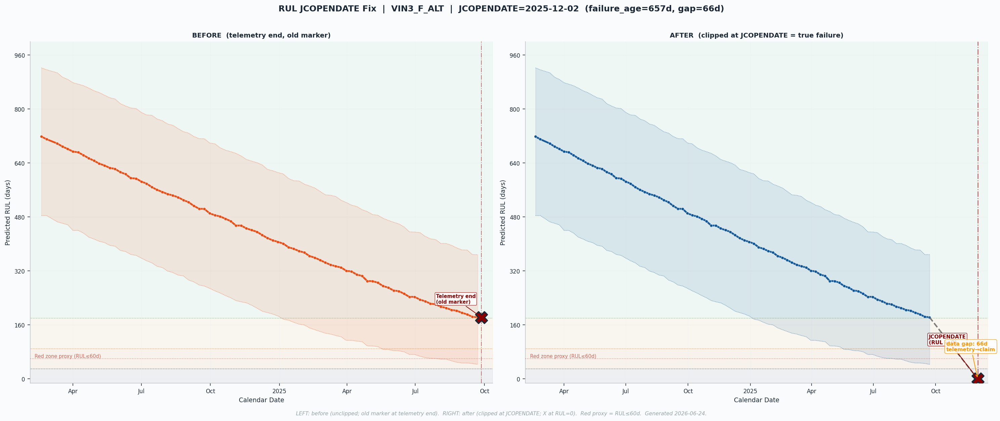

## 8. Fleet Overlay

The fleet overlay shows all 25 trucks' RUL trajectories on a common calendar x-axis after the JCOPENDATE fix. Failed trucks (red) converge to RUL = 0 at their respective JCOPENDATEs; non-failed trucks (blue) retain positive RUL across the observation window.

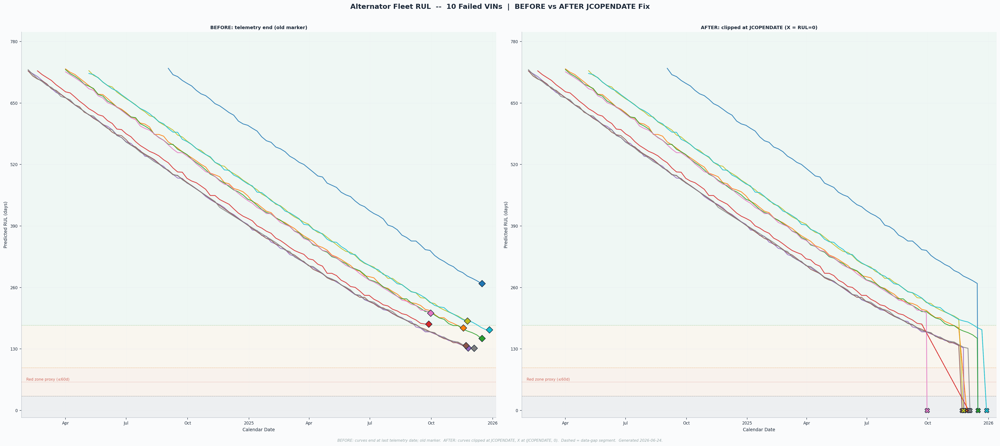

## 9. Per-VIN Detection & Failure Modes

Sections 1–8 validate the fleet-level system; this section presents the **per-truck** picture — honestly split into what the model catches and how alternators actually fail.

**Detection (optimistic, and real).** Each truck receives its own LOVO risk score. The RED band is **pure — 7 failures and 0 false alarms** (no healthy truck reaches it); 9 of 10 failures land in the alert zone (only VIN5 is missed, at 0.28). Four failures additionally give a hard, schedulable lead time — VIN1 21 d (GED storm), VIN2 16 d (under-voltage sag), VIN6 11 d and VIN10 11 d (crank-recovery) — and VIN1 shows a ~199-day condition decline.

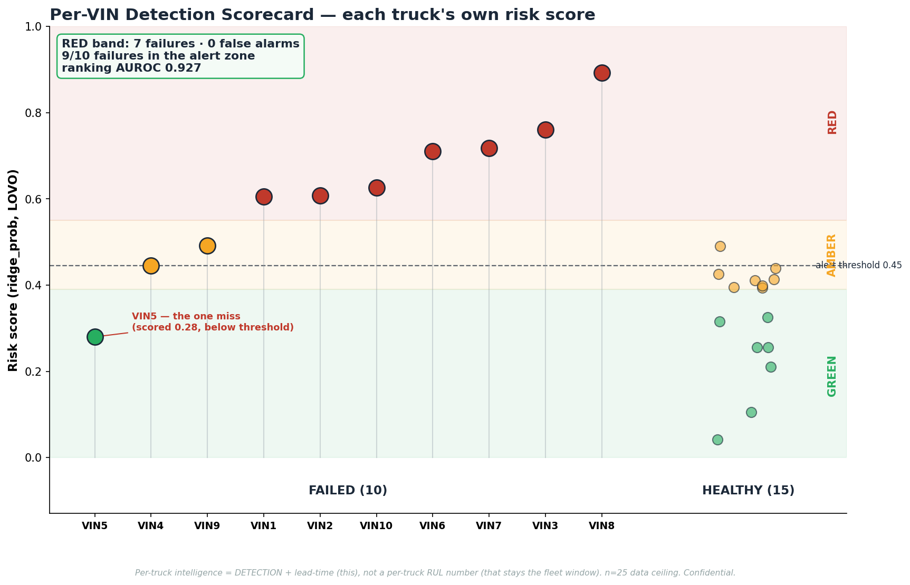

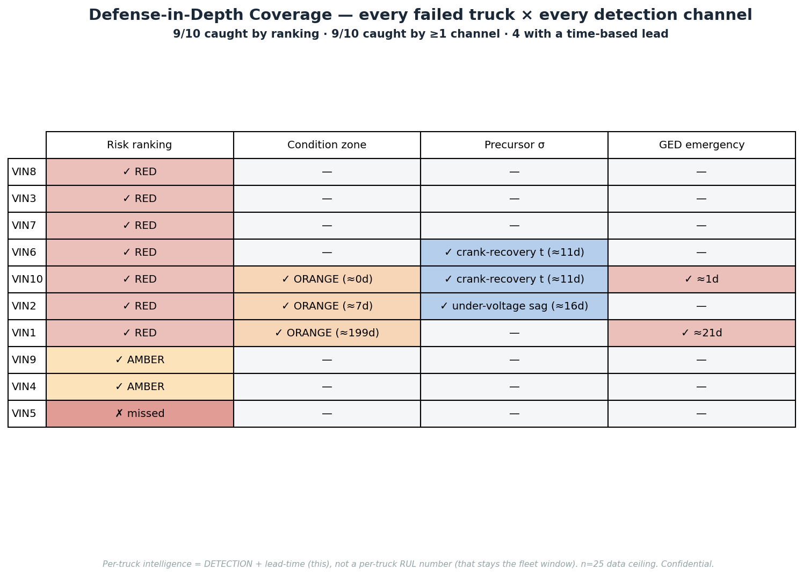

**Failure modes (honest).** Alternators are electrical components that mostly stop **abruptly** (regulator / diode / brush). The data confirms it: **6 of 10 failures give no telemetry footprint** — charging voltage sits flat at ~28 V to within three days of failure, with no gradual decline in any signal. Only four give a short discrete-event warning; only VIN1 a long runway. The honest implication: abrupt failures cannot be predicted at the moment level — they are mitigated by **population** (the 601-day fleet window / age replacement), while condition monitoring buys lead time only for the gradual minority.

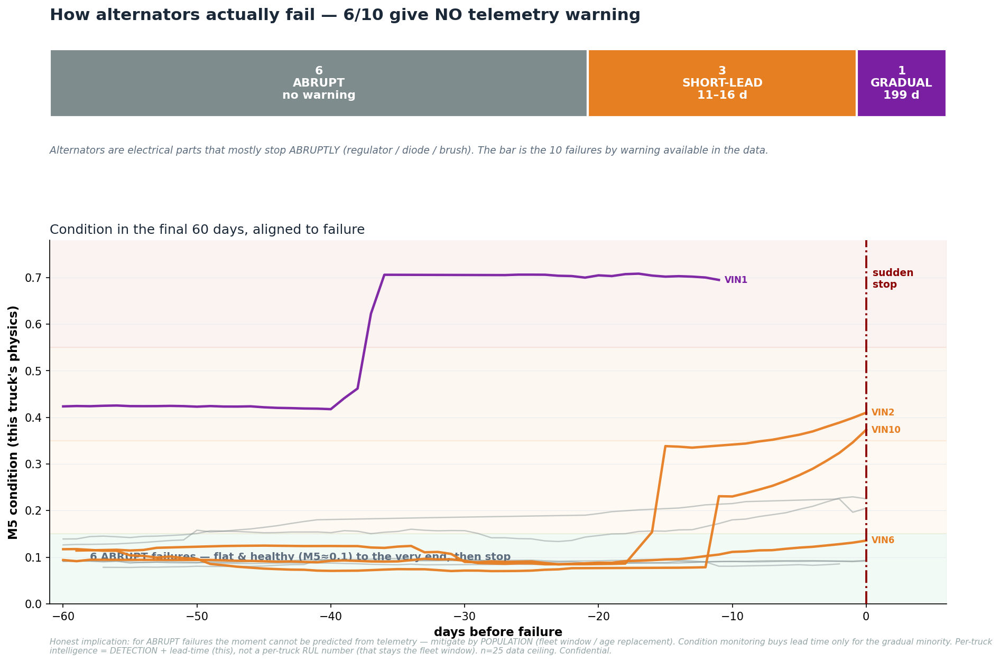

## 10. Limitations

1. **n = 25 / 10 events is the data ceiling.** With only 10 observed alternator failures, statistical estimates carry wide uncertainty (bootstrap 95% CI: [0.807, 1.000]). Adding more trucks — especially from geographically diverse corridors — is the single highest-leverage improvement available.

2. **Exposure confound on `progressive_drift`.** Healthy trucks observed for longer accumulate more cumulative voltage drift, reversing the expected direction. The negative Ridge coefficient partially corrects for this, but the feature carries the lowest permutation importance (0.048) and is retained only to preserve the frozen V10.5.3 validated spec.

3. **Aged-fleet observation bias.** The non-failed fleet was monitored until the end of 2025. Trucks that had not yet failed may simply not have reached their failure age — they are right-censored, not proven healthy indefinitely. The 601-day replacement window reflects observed failure ages; it should be updated as the fleet ages further.

4. **No per-truck timing from the classifier.** The Ridge score ranks trucks but does not produce a reliable per-truck RUL point estimate: per-truck MAE is 140.4 days vs. a naive fleet-clock MAE of 49.7 days. The fleet-clock beats the covariate model (verdict: NO_IMPROVEMENT_HONEST). The operational deliverable is the **risk band** and the **601-day fleet window**, not per-truck day-level predictions.

5. **Emergency channel coverage is limited.** GED=2 storm fires for 2/10 failed VINs (21d and 1d lead respectively). Compound early-watch fires for 3/10 failed VINs. No signal was available for the remaining failed trucks before failure, consistent with domain knowledge that abrupt alternator failures have no detectable electrical precursor.

6. **4-zone temporal health system is weak.** Only 3/10 (30%) failed VINs reach ORANGE or RED in the M5 zone system; 6/15 healthy trucks also enter those zones. The temporal zone system is supplemental context, not a reliable standalone alert.

## 11. Recommendation — Deploy Now, Grow Data

The V11.2_ALT system is **recommended for operational deployment** at DICV on the following basis:

- **Ranking** (WHICH box): A LOVO AUROC of 0.9267 — 139 of 150 concordant pairs — provides a reliable fleet risk-ranking that maintenance teams can act on. The top-10 inspection list catches 9/10 known failures.

- **Fleet window** (WHEN-fleet box): The 601-day / ~120,440 km replacement window provides a defensible procurement and scheduling anchor derived from observed failure ages. This is the primary timing deliverable.

- **Emergency channels** (WHEN-emergency box): GED=2 excitation-disturbance monitoring and the compound early-watch (5 B-family heuristics, equal vote, threshold ≥ 2) produce **zero false alarms** on the 15 healthy trucks and fire ahead of failure for 2 and 3 trucks respectively. These channels augment but do not replace the ranking.

- **Data ceiling is not a method ceiling.** The model has reached the limit of what n=25 / 10 events can support. Expanding the fleet to 100+ trucks — with continued telemetry ingestion — is expected to narrow the bootstrap CI, improve zone discrimination, and enable more reliable per-truck timing. The Phase-2 recommendation is to deploy V11.2 now and retrain on a richer dataset as it accumulates.

---

*Report generated by `V11_2_ALT_build_report.py` on 2026-06-26. All numbers sourced from result files under `V11.2_ALT/results/`. Metrics from LOVO cross-validation only.*